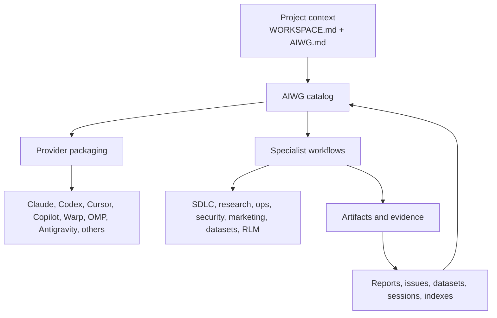
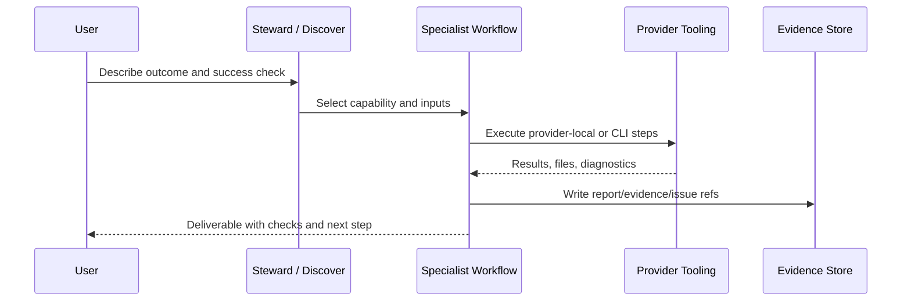
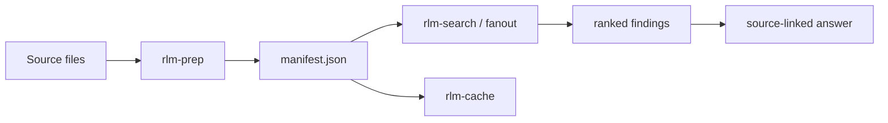

<div align="center">

<a href="https://aiwg.io"></a>

# AIWG

**Reusable project context and specialist workflows for the AI tools you already use.**

Plan software, coordinate specialist reviews, prepare campaigns, investigate incidents, organize research, curate
media, and maintain operational knowledge. AIWG combines agents, skills, rules, templates, and workflow utilities
around these tasks, adapting them to your existing AI provider.

Project artifacts carry decisions from one session to the next. Domain frameworks supply the procedures; addons extend
them with writing profiles, task loops, memory, testing tools, and other capabilities. The sections below show what
you can do, how the pieces work together, and how to use them.

The simplest setup is to paste this into a supported AI provider:

```text
Install or repair AIWG for this project by following
https://aiwg.io/setup.aiwg.yaml
Explain the plan before changing anything, preserve my existing work, and ask
me only for choices you cannot safely determine.
```

The installer detects old, broken, duplicate, and development-mode installs,
then guides you through repair or update. It deploys the preferred complete
system with one self-verifying `aiwg use all` command. That command refreshes
the indices, regenerates project context, verifies the resulting deployment,
and reports whether a provider reload is actually required.

For long-running agents that need an isolated executor, optionally install AIWG Cockpit with a self-hosted Agentic
Sandbox executor you control and audit:

```text
Install or repair AIWG Cockpit and Agentic Sandbox by following
https://aiwg.io/agentic-sandbox/setup.aiwg.yaml
Install the required prerequisites, explain the plan before changing anything,
preserve my existing work, and ask me about the isolation, network, storage,
and access choices you cannot safely determine.
```

This option audits the host, installs the approved Docker or KVM/libvirt runtime
and sandbox prerequisites, connects Cockpit to the real executor, applies your
resource and access choices, and verifies the control and audit path end to end.

If you prefer to install manually:

```bash
npm i -g aiwg
cd /path/to/your/project
aiwg use all --provider <provider>
```

Replace `<provider>` with your AI tool's name, such as `claude`, `codex`,
`copilot`, `cursor`, `omp`, or `pi`.

The final command deploys, indexes, connects, verifies, and reports one outcome.
The standalone index, regenerate, status, and doctor commands remain available
for advanced maintenance and troubleshooting; they are not extra install steps.

For the complete beginner path and provider-name table, see
[Install, Connect, and Verify](docs/getting-started/install-connect-verify.md).

For a lightweight install that resolves signed, versioned resources from the release host, install the executable:

```bash
npm i -g @aiwg/cli
```

> Find the architecture-evolution workflow, read its requirements, and help me apply it to this project.

See [Web-Backed AIWG Resources](docs/install/web-backed-resources.md) for source
selection, exact-version overrides, cache verification, offline use, and the
current framework-graph constraints.

For a larger project, ask your AI assistant to establish project policy as well. The agent-led setup
conversation should establish remotes, issue storage, delivery behavior,
signing policy, and provider choices; the assistant discovers the project-setup workflow and handles its tools.

macOS users: if npm fails with `EACCES` under `/usr/local/lib/node_modules`,
use the [macOS Install Guide](docs/getting-started/macos-install.md).
Agents and stewards setting up AIWG end-to-end should use the
[Agentic Install Runbook](docs/agentic-install-runbook.md).

[](https://www.npmjs.com/package/aiwg)
[](https://www.npmjs.com/package/aiwg)
[](LICENSE)
[](https://github.com/jmagly/aiwg/stargazers)
[](https://nodejs.org)
[](https://www.typescriptlang.org)
[](#platform-support)
[](https://mcpservers.org/servers/docs-aiwg-io)

[](https://aiwg.io/badges)

[**Get Started**](#quick-start) · [**Features**](#what-you-get) · [**Agents**](#agents) · [**Documentation**](#documentation) · [**Community**](#community--support) · [**Badges**](https://aiwg.io/badges)

[](https://discord.gg/BuAusFMxdA)
[](https://t.me/+oJg9w2lE6A5lOGFh)

</div>

---

## Installation Troubleshooting

### Optional native features

The base global install intentionally excludes native packages whose lifecycle
scripts require explicit trust. Core deployment, discovery, and provider tooling
work without them. Enable only the capability you need:

> Enable the native features needed for interactive terminals, semantic search, or graph-backed artifacts in this
> workspace. Explain which dependencies are required, install only the selected features, and verify they load.

The feature installer writes a private manifest and lockfile under the AIWG user
data directory and approves scripts only for that feature. Do not set a broad
user-level npm `allow-scripts` policy. If an older install left native package
files present but unbuilt, `aiwg doctor` reports the broken capability and the
same scoped rebuild command.

### macOS npm `EACCES`

If `npm install -g aiwg` fails with `EACCES` while writing to
`/usr/local/lib/node_modules/aiwg`, npm is using a system-owned global install
directory. The [Node.js setup guide](docs/getting-started/install-node.md) covers the supported runtime and
version-manager choices. After setting up Node, run:

```bash
npm install -g aiwg
aiwg doctor
```

If Node is already installed and you need a quick recovery, one manual alternative is a user-owned npm prefix. Choose
this only after checking your existing Node version-manager configuration:

```bash
npm config set prefix ~/.local
echo 'PATH="$HOME/.local/bin:$PATH"' >> ~/.profile
echo 'source ~/.profile' >> ~/.zprofile
source ~/.profile
npm install -g aiwg
```

See [macOS Install Guide](docs/getting-started/macos-install.md) for the full
walkthrough. Avoid `sudo npm install -g aiwg` as the default fix; it can create
root-owned npm files that break later upgrades.

### `aiwg` command not found

If `aiwg` is not found after `npm i -g aiwg`, the npm global `bin` directory is not on your `PATH`. Confirm and fix:

> Diagnose why this shell cannot find AIWG. Check the npm installation and PATH, and apply the appropriate local fix.

You can also invoke AIWG without adjusting `PATH` by using `npx aiwg doctor`. For a broader health check — version,
deployed providers, missing dependencies, kernel-skill probes — run `aiwg doctor`. See the [troubleshooting
guide](docs/troubleshooting/index.md) for the full recovery paths.

---

## What AIWG Is

AIWG gives your AI assistant reusable project context and specialist workflows. Its deployment layer connects those
instructions to your provider: `aiwg use` copies markdown and YAML source files into the paths each provider reads, so
one source of truth works across 18 named provider integrations. A nineteenth `generic` adapter emits portable files
for unrecognized or custom harnesses and is not counted as a named integration.

Around that core, AIWG ships agent-facing utilities for work that benefits from additional structure: persistent
artifact memory (`.aiwg/`), background orchestration, autonomous loops, artifact indexing, cost telemetry, health
diagnostics, and more. These are tools the agent calls when the task calls for them — you stay in chat. Most are
opt-in. The deployment layer works standalone as plain text files the platform reads natively.

### Project scope (recommended) vs user scope (global)

`aiwg use` supports project deployments, additive user mirrors, and a
user-global bootstrap:

- **Project scope** — default. Run `aiwg use all --provider <provider>` from a project root and the artifacts land in
  that provider's project paths. This keeps project-specific instructions associated with the intended repository.
  Some providers also use user-level surfaces; check the reported deployment scope. **This is the recommended default
  for new users.**
- **User scope (additive mirror)** — `aiwg use all --provider <provider> --scope user` keeps the
  project deployment and mirrors it to `~/.claude/agents/`,
  `~/.claude/skills/`, etc.
- **Global bootstrap** — `aiwg use all --provider claude --global` installs
  framework and kernel assets in native user-level paths while leaving only
  lightweight context and provider bootstrap files in the current project.
  Ask the assistant to connect additional projects without
  deploying their own skill copies.

Shared user-level instructions can be useful for personal conventions, while project-local instructions keep a team's
requirements and decisions with its repository. Review both scopes when a provider uses them together. The installer
and provider inventory describe where files will go, so you can distinguish instructions that follow you across
projects from instructions intended for this workspace.

See the [Agentic Install Runbook](docs/agentic-install-runbook.md) for the
zero-to-running setup path, and the [CLI reference](docs/cli/reference.md) (under `aiwg use` →
"Scope models") for the per-provider details and the global-install rough-edge
inventory.

## Simple Building Blocks

AIWG's workflow source is readable and editable. The main building blocks are:

- **Agents** — specialist role instructions, such as Security Auditor or Test Architect, with defined responsibilities
  and supported tool access.
- **Skills** — reusable procedures an agent can find from a goal and follow during a task.
- **Commands** — explicit ways to request a workflow through the provider or CLI.
- **Rules** — constraints for the assistant to follow, with tool-based checks where configured.
- **Behaviors** — lifecycle actions and hooks on providers that support them.
- **Templates** — structures for requirements, briefs, review reports, runbooks, and other outputs.

Many assets use Markdown with YAML metadata; hooks and utilities may also include executable scripts or structured
configuration. The provider determines how each asset is loaded or invoked. A role definition is not a separate model,
and a written rule is not proof that its constraint was enforced.

## Why It Compounds

The building blocks become more useful when workflows share their outputs:

- A requirements analyst records acceptance criteria that the test engineer can later use to review coverage.
- A security reviewer reads the same design decision as the implementation agent and records concerns against that decision.
- A campaign brief gives content writers a shared audience, message, and review criteria.
- A research note connects a source to the claim it supports, so a later synthesis can revisit the original evidence.
- A runbook carries verification and recovery steps from planning into an operational change.

Frameworks package these relationships: agents, skills, rules, and templates reference one another, while `.aiwg/`
holds the project-specific work they produce. A review can follow **Primary Author → Reviewers → Synthesizer →
Approval → Archive**, using parallel execution where the provider and task support it.

For example, Monday's architecture review can become Thursday's implementation checklist. The second session needs to
read the saved artifact and check that it is still applicable, but the team has a concrete record to work from rather
than reconstructing the decision from conversation fragments.

Research on structured artifacts, multi-agent review, and recovery informs this design. The [research
foundations](#research-foundations) section preserves that background separately from claims about AIWG's own
performance.

## How You Actually Use AIWG

Describe the outcome you want in your AI tool. You do not need to learn a new command language or memorize skill
names: “Help me start a project,” “Review this design for security risks,” or “Prepare a deployment plan with rollback.”

The assistant interprets your intent, searches AIWG's capability graphs, reads the matching assets, and follows their
procedures. Discovery brings together packaged AIWG capabilities and indexed project-local custom skills, agents,
rules, and workflows; user-level assets participate when project policy allows them. Your team's indexed assets can
therefore be found through the same conversation as AIWG's built-in capabilities. Newly authored assets need to be
deployed or indexed before discovery can find them.

For everyday setup and maintenance, ask:

- “Set up the SDLC framework for this project and my AI tool.”
- “Help me configure this project's tracker, delivery, signing, and provider preferences.”
- “Create a new project for this idea.”
- “Check which AIWG capabilities are active here and fix any setup problems.”
- “Update AIWG and refresh this project's deployed assets.”

The assistant handles discovery, artifact lookup, and the selected workflow's tools, then reports the result and its
verification. Matching a capability is a starting point: the assistant still checks scope, prerequisites, and project
policy before acting.

For manual setup and maintenance, the usual commands are `aiwg use`, `aiwg init`, `aiwg refresh`, and `aiwg doctor`.
The assistant handles other tooling. Advanced command syntax lives in the [CLI reference](docs/cli/reference.md).

Deployment connects the supported workflow surface. Optional servers, storage services, and automation paths have
their own prerequisites; installing assets does not mean all those services are running. You can start with one review
or document task, then enable additional utilities as the work requires.

## What AIWG Is Not

AIWG adds context, procedures, and support utilities around the AI tools you use. The deployment core writes
provider-readable assets; optional orchestration and integration components can invoke provider runtimes or other
configured services. The [architecture overview](docs/architecture-overview.md) distinguishes those components.

It does not replace your provider subscription, your application's runtime, or the review needed before using
generated work. Most workflows operate on project artifacts and source files rather than requiring your application to
import an AIWG library. Keep generated configuration and project artifacts under the same review discipline as other
repository changes.

## Who It's For

AIWG is useful to individual developers, engineering teams, technical leaders, researchers, marketers, and operators
whose work spans several tasks or sessions. It helps when you need reusable instructions, a shared record of
decisions, or reviews from more than one perspective.

You can start at several levels: a small documentation review, a focused code audit, a campaign brief, an
investigation plan, or a complete development lifecycle. The [capability guide](docs/overview/capabilities.md) offers
task-based routes, while this README keeps the broader feature and workflow detail available below.

---

## What Problems Does AIWG Solve?

AI-assisted projects often need a deliberate way to carry context forward, recover from failed attempts, and make
review criteria explicit. AIWG provides workflows and artifacts for each of those needs.

### 1. Maintaining Context Across Sessions

Useful decisions can become scattered between conversations, issues, and source files. AIWG workflows save project
outputs in `.aiwg/`, including requirements, architecture decisions, risk notes, test strategies, and campaign
material.

A later task can consult the relevant artifact and link its own work back to it. The requirements analyst writes a use
case; the test engineer reads it to identify missing coverage; the implementation review checks whether the behavior
matches the acceptance criteria. A changed decision can be recorded and propagated through those relationships.

The structure also helps an agent select context for a large project. Instead of treating every file as equally
relevant, a task can begin with a requirement, design record, or source note and follow its supporting references.
Artifact lookup and indexing utilities help locate those records as the collection grows.

The benefit depends on keeping artifacts current and actually consulting them. A saved file is a reusable source of
context, not a guarantee that every later response will use it correctly.

### 2. Recovering from Failed Attempts

A failing test or incomplete task needs a diagnosis, not just another attempt with the same assumptions. Agent loops
support an execute-and-verify cycle that records failure information, adapts the next attempt, and stops at configured
limits or escalation conditions.

Use a loop for a bounded change with an observable completion criterion: fixing a regression, bringing a module under
test, or carrying out a migration plan. External loop tooling adds process and session recovery where supported. Its
usefulness depends on the provider, environment, task boundaries, and verification command; unattended execution is
not a guarantee of completion.

The record of attempts can help a later session understand what was tried and why it failed. That makes the recovery
process reviewable even when the agent needs human input or cannot complete the task.

### 3. Making Quality Criteria Explicit

Different reviews ask different questions. A security review examines exposure and trust boundaries; a performance
review examines expected load and bottlenecks; a test review checks whether acceptance criteria are exercised; a
writing review checks audience, clarity, and support for claims.

AIWG supplies specialist roles and workflows that separate these concerns, combine their findings, and record open
decisions. Phase gates can check whether the required artifacts and reviews are ready before the work advances.
Project policy determines who must approve a decision and which checks are required.

Multiple reviewers can still share an error. The practical benefit is a clearer review procedure and a saved account
of the findings, with tests or other independent checks where available.

---

## The Six Core Components

### 1. Memory — Structured Semantic Memory

The `.aiwg/` directory is a persistent artifact repository storing requirements, architecture decisions, test
strategies, risk registers, and deployment plans across sessions. Artifacts provide retrievable project knowledge that
can ground later work in recorded decisions and sources.

Artifacts can be referenced with `@-mentions` (e.g., `@.aiwg/requirements/UC-001-login.md`). Context sharing between
agents happens through artifacts: the requirements analyst writes use cases, the architecture designer reads them.

### 2. Reasoning — Multi-Agent Deliberation with Synthesis

AIWG provides specialist role definitions organized by domain. A workflow can route a complex artifact through the
reviewers the task requires:

```
Architecture Document Creation:
  1. Architecture Designer drafts SAD
  2. Review Panel (3-5 agents run in parallel):
     - Security Auditor    → threat perspective
     - Performance Engineer → scalability perspective
     - Test Architect       → testability perspective
     - Technical Writer     → clarity and consistency
  3. Documentation Synthesizer merges all feedback
  4. Human approval gate → accept, iterate, or escalate
```

Each reviewer receives a defined responsibility and relevant context. The synthesis should resolve duplicate or
conflicting findings, preserve uncertainty, and identify which conclusions were checked against sources or tests.
Parallel reviews require the corresponding provider capability and available task budget.

### 3. Learning — Closed-Loop Self-Correction (Agent Loop)

The agent loop executes tasks iteratively and uses verification results to guide the next attempt. Its task record can preserve
failure analysis and revised strategies for subsequent iterations.

```
Agent Loop Iteration:
  1. Execute task with current strategy
  2. Verify results (tests pass, lint clean, types check)
  3. If failure: analyze root cause → extract structured learning → adapt strategy
  4. Log iteration state (checkpoint for resume)
  5. Repeat within configured limits; stop or escalate when required
```

The external agent loop (`agent-loop-ext`) adds process tracking, session persistence, and recovery controls. For long-running work, define a time
or iteration budget and inspect the provider-specific recovery behavior; surviving a particular failure depends on how
the runner and host are configured.

### 4. Verification — Bidirectional Traceability

AIWG supports links between documentation and code so reviewers can inspect relationships and find drift:

```typescript
// src/auth/login.ts
/**
 * @implements @.aiwg/requirements/UC-001-login.md
 * @architecture @.aiwg/architecture/SAD.md#section-4.2
 * @tests @test/unit/auth/login.test.ts
 */
export function authenticateUser(credentials: Credentials): Promise<AuthResult> {
```

Verification can follow Doc → Code, Code → Doc, Code → Tests, and Citations → Sources. These relationships make claims
easier to inspect; they do not prove that implementation or citations are correct. Ask the workflow to report missing
targets, inconsistent behavior, and unsupported source claims.

### 5. Planning — Phase Gates with Cognitive Load Management

AIWG structures work using Cooper's Stage-Gate methodology (1990), breaking multi-month projects into bounded phases with explicit quality criteria and human approval:

```
Inception → Elaboration → Construction → Transition → Production
   LOM          ABM            IOC            PR
```

Phase structure gives a team bounded decisions and review points: establish goals during Inception, evaluate design
and risks during Elaboration, implement and verify during Construction, and prepare operational handoff during
Transition. Templates help make the expected outputs visible. The project determines which artifacts, reviewers, and
approval gates are appropriate; a small task need not use the full lifecycle.

### 6. Style — Controllable Voice Generation

Voice profiles describe writing preferences such as formality, technical depth, directness, examples, uncertainty, and
sentence variation. They give the assistant a reusable style specification that can be reviewed against the audience
and document purpose.

Built-in voices: `technical-authority` (docs, RFCs), `friendly-explainer` (tutorials), `executive-brief` (summaries),
and `casual-conversational` (blogs, social). Ask “Create a reusable voice profile from these writing samples” to
define your own.

---

## A Real Project Walkthrough

The following illustrative customer-portal project shows how ordinary prompts connect the components across a
lifecycle. These examples describe requests you can make, not a measured project outcome. The assistant discovers
the relevant procedures and reads their instructions before carrying out each request.

Start with a bounded goal, agree on acceptance criteria, and inspect the artifacts at each step. The time and review
effort depend on the project, source quality, tools, and decisions involved. Smaller changes can enter at the phase
that fits their current state rather than repeating the entire lifecycle.

### Inception

> Help me define a customer portal with real-time chat. Walk me through the goals, users, constraints, and acceptance criteria.

**Memory**: Intake forms capture goals, constraints, stakeholders in `.aiwg/intake/`
**Planning**: Executive Orchestrator guides through structured questionnaire
**Reasoning**: Requirements Analyst drafts initial use cases, Product Designer reviews UX
**Verification**: Requirements reference intake forms, ensuring alignment
**Human Gate**: Stakeholder reviews intake → approves transition to Elaboration

### Elaboration

> Review the approved intake, develop the architecture and test strategy, and identify the risks we need to resolve.

**Memory**: Architecture doc, ADRs, threat model, test strategy accumulate in `.aiwg/`
**Reasoning**: Multi-agent review panel — Architecture Designer drafts, Security Auditor + Performance Engineer + Test Architect critique in parallel, Documentation Synthesizer merges
**Learning**: The agent loop iterates on ADRs (generate options, evaluate against constraints, refine)
**Style**: Technical documents use `technical-authority`, stakeholder summaries use `executive-brief`
**Human Gate**: Architect reviews SAD, security team approves threat model

### Construction

> Turn the reviewed design into an implementation plan. Implement authentication, verify its acceptance criteria,
> and run the relevant tests.

**Learning**: The agent loop handles implementation iterations — execute, verify (run tests), learn ("async race condition in token refresh"), adapt (add synchronization), retry
**Verification**: Code references requirements (`@implements UC-001`), tests reference code
**Memory**: Test plans, implementation, deployment scripts accumulate across iterations
**Human Gate**: Code review approves merges, QA approves test results

### Transition

> Prepare the production rollout with monitoring and rollback. After the required release approval, deploy it and
> organize fourteen days of early-life support.

**Planning**: Deployment checklist — monitoring, rollback plan, incident response
**Learning**: Failed validation produces a diagnosis and a revised plan; retries follow the operation's recovery and
approval requirements
**Verification**: Deployment scripts reference architecture (which services, what order)
**Human Gate**: Operations team reviews deployment plan → approves production release

---

## Claims, Evaluation, and Evidence

Evaluate a workflow against the task it is meant to support. AIWG provides structures for review, traceability, and
recovery; it does not promise a fixed cost saving, perfect citations, or error-free execution.

| Capability to evaluate | Evidence to collect | Useful comparison |
|------------------------|---------------------|-------------------|
| Persistent project context | Whether a later session reads and applies a prior decision | The same kind of task with the team's usual handoff |
| Specialist review | Correct findings, missed issues, and reviewer effort | A comparable review using the existing process |
| Task recovery | Failure diagnosis, attempts, limits, and final verification | Similar failures handled without the loop |
| Citation checking | Source existence and support for each material claim | Manual source inspection |
| Structured planning | Completeness and usefulness of the resulting plan | The team's existing planning artifact |
| Cost and throughput | Model calls, elapsed time, and human review effort | Comparable tasks with the same acceptance criteria |

Research results from Agent Laboratory, self-consistency, tree search, and other systems inform the design. Their
percentages and benchmark scores are not measurements of AIWG. The [research foundations](#research-foundations) and
[reading list](docs/overview/reading-list.md) retain the underlying sources. The [executive
brief](docs/overview/executive-brief.md) describes a practical pilot.

---

## When to Use AIWG (and When Not To)

### Good Fit

Multi-week or multi-month projects where requirements evolve, multiple stakeholders have different concerns, quality gates are required, auditability matters, or context exceeds conversation limits.

**Examples**: New product features with architecture/security/operational implications, legacy system migrations requiring phased rollback strategies, research projects needing literature review and reproducibility, compliance-heavy domains (healthcare, finance, aerospace) needing audit trails.

### Not the Best Fit

A full lifecycle is usually unnecessary for a one-off question that needs no shared context, saved artifact, or
follow-up. A focused writing, lookup, or review capability can still be useful without introducing every phase and
gate.

**Examples**: "Write a Python script to parse this CSV," "Fix this typo," "Explain how this code works."

### The Trade-off

Match the workflow to the task. Use a bounded skill for a small result, a saved artifact when work needs to carry
forward, and a phase-based process when coordination and review warrant it. Additional context, reviewers, or
verification steps can add model calls and human effort; judge their value against the outcome you need.

```
User intent → AIWG CLI → Deploy agents + rules + templates → AI platform
                │                                                │
                ▼                                                ▼
         "aiwg use all --provider X"                  Claude Code / Copilot /
                │                                     Cursor / Warp / Factory /
                ▼                                  OpenCode / Codex / Devin Desktop
         ┌──────────────┐
         │ Agents       │  Specialized AI personas with domain expertise
         │ Commands     │  CLI + slash commands for workflow automation
         │ Skills       │  Natural language workflow triggers
         │ Rules        │  Enforcement patterns (security, quality, anti-laziness)
         │ Templates    │  SDLC artifact templates with progressive disclosure
         └──────────────┘
                │
                ▼
         .aiwg/ artifacts ← Persistent project memory across sessions
```

---

## How It Works

> For visual diagrams of AIWG's architecture, deploy flow, and discovery model, see [`docs/architecture-overview.md`](docs/architecture-overview.md). The prose walkthrough lives in [`docs/how-it-works.md`](docs/how-it-works.md).

**At a glance** — the deployment layer copies instructions into provider-readable locations, connects project context,
and reports verification. The provider loads those instructions. Optional runtime components, such as artifact
services or orchestration tools, perform additional work when configured and invoked.

```mermaid
flowchart LR
  subgraph Source["AIWG framework source"]
    direction TB
    KERN["Kernel skills<br/>within provider listing budgets"]
    STD["Standard skills<br/>read from $AIWG_ROOT"]
    AGENT["Specialist agents"]
    RULES["Workflow rules"]
    TPL["Artifact templates"]
  end

  CLI(["aiwg use all<br/>--provider X"]) --> DEPLOY

  subgraph DEPLOY["Deploy step (one-shot)"]
    direction TB
    COPY["Copy kernel skills, agents,<br/>rules to provider-native dirs"]
    INDEX["Build artifact index<br/>~/.local/share/aiwg/index/"]
    CTX["Emit AIWG.md + AGENTS.md<br/>at project root"]
  end

  Source --> CLI
  DEPLOY --> Project

  subgraph Project["Your project (after deploy)"]
    direction TB
    PLAT[".claude/skills/<br/>.codex/agents/<br/>.warp/agents/ ..."]
    AIWGMD["AIWG.md / .hermes.md /<br/>WARP.md / AGENTS.md"]
    ART[".aiwg/<br/>requirements/<br/>architecture/<br/>..."]
  end

  Project --> SESS

  subgraph SESS["AI session (Claude / Codex / Hermes / etc.)"]
    direction TB
    NATIVE["Platform-native loader<br/>reads provider dir"]
    DISC(["Assistant capability discovery<br/>+ asset lookup"])
  end

  classDef optional stroke-dasharray: 5 5,fill:#fef9e7
  class DISC optional
  class INDEX optional
```



**Multi-agent orchestration** — once deployed, AIWG coordinates specialized agents through phase-gated workflows:

```
You: "transition to elaboration phase"

AIWG: [Step 1] Requirements Analyst   → Analyze vision document, generate use case briefs
      [Step 2] Architecture Designer  → Baseline architecture, identify technical risks     } parallel
      [Step 3] Security Architect     → Threat model, security requirements                 }
      [Step 4] Documentation Synth.   → Merge reviews into Architecture Baseline Milestone
      [Step 5] Human Gate             → GO / CONDITIONAL_GO / NO_GO decision
      [Step 6] → Next phase or iterate
```

The orchestration pattern: **Primary Author → Parallel Reviewers → Synthesizer → Human Gate → Archive**. Agents run in parallel where possible, with human-in-the-loop checkpoints at phase transitions.

---

## Features

- **Specialist agents** — roles for architecture, implementation, testing, security, cloud, data engineering,
  research, content, and operations.
- **Workflow skills and commands** — discoverable procedures for reviews, intake, research, curation, planning, and delivery.
- **Rules and review criteria** — instructions for preserving work, handling sensitive configuration, checking claims,
  and reporting verification.
- **Artifact templates** — structured requirements, design decisions, campaign briefs, source notes, runbooks, and
  review reports.
- **Multi-provider deployment** — Google Antigravity CLI, Claude Code, OpenAI Codex, GitHub Copilot, Cursor, DeepSeek
  Harness, Factory AI, Hermes, OpenCode, OpenClaw, OpenHuman, Pi Coding Agent, Oh My Pi, Warp Terminal, and Devin
  Desktop.
- **Domain frameworks** — software development, forensics, marketing, research, media curation, operations, knowledge
  base, and security engineering.
- **Dataset workflows** — assessment, indexing, lineage, synchronization, and retirement through dataset intelligence;
  the separate [`aiwg-training`](https://github.com/jmagly/aiwg-training) project covers training-data curation and
  exports.
- **Memory addons** — compound memory, line memory, wiki-oriented knowledge, and artifact lookup for different
  persistence needs.
- **Writing and voice tools** — reusable voice profiles, context-sensitive diagnostics, revision workflows, and
  alternatives for content generation.
- **Testing quality** — test conformance, reversible normalization, mutation testing, and flaky-test review.
  See the [AIWG test conformance example](docs/conformance-aiwg-example.md) for reviewed source controls
  and runner evidence.
- **Agent loops** — bounded execution, failure analysis, checkpoints, and supported process recovery.
- **RLM** — recursive context decomposition for tasks whose source material needs to be divided into smaller working sets.
- **YAML metalanguage** — structured workflow and artifact definitions with schema-oriented validation.
- **MCP integration** — tools and resources exposed through configured servers and provider connections.
- **Traceability and provenance** — relationships between requirements, code, tests, sources, and generated artifacts.
- **Session history and diagnostics** — import and inspect prior AI work, check deployment health, and diagnose
  provider wiring.
- **Project-local extensions and marketplace delivery** — keep custom instructions with the project and package
  reusable capabilities through the appropriate distribution path.

The [framework and addon catalog](#what-you-get) below describes these capabilities in more detail. Compatibility and
execution requirements are explicit in the [provider inventory](docs/providers/provider-inventory.md) and [CLI
reference](docs/cli/reference.md).

---

## Quick Start

> **Prerequisites:** Node.js >=20.0.0 and an AI platform (Claude Code, GitHub Copilot, Cursor, Warp Terminal, or others). New installs should prefer Node 24. See [Prerequisites Guide](docs/getting-started/prerequisites.md) for details.

> **Release verification:** Inspect the provenance and signature material for the release you install. The
[verification guide](docs/releases/verifying.md) describes the available artifacts and commands.

### Install & Deploy

The prompt-led installer at the top of this README is the canonical beginner path. For manual setup:

```bash
npm i -g aiwg
cd /path/to/your/project
aiwg use all --provider claude   # replace claude with your provider selector
```

Deployment refreshes the shared context and reports verification and any required reload. Follow that result, then ask
the agent to check the intended project and its AIWG connection. The [manual installation
reference](docs/cli/install-and-repair.md) covers the terminal path in detail.

For a deliberately narrower deployment, choose the relevant framework or addon instead of `all`. These are
alternatives, not a sequence of required setup steps:

```bash
aiwg use sdlc --provider claude          # Software development
aiwg use forensics --provider claude     # Investigation workflows
aiwg use marketing --provider claude     # Campaign and content work
aiwg use media-curator --provider claude # Media collections
aiwg use research --provider claude      # Research artifacts
aiwg use civic-action --provider claude  # Civic review and preparation
aiwg use rlm --provider claude           # Context decomposition
```

For maintenance or an existing workspace that needs context migration, preview the relevant regeneration branch rather
than treating every branch as installation:

> Preview how to refresh this workspace’s provider context. If it needs existing-project extraction or migration,
> explain the proposed changes, preserve project-specific instructions, and verify the result.

The [regeneration guide](docs/regenerate-guide.md) also covers canonical refresh and legacy compatibility. Use the
branch that matches the workspace state. To scaffold a new project rather than connect the current one, see the
[new-project guide](docs/getting-started/new-project.md).

### Get a First Useful Result

After setup, ask your agent:

```text
Use AIWG to review this project's README for unclear positioning and missing
onboarding steps. Save a report at
.aiwg/marketing/brand/audit/readme-review.md with file references and the
three highest-priority fixes. Leave the README unchanged.
```

Open the report and check the source references, reader impact, and proposed fixes. In a later session, ask the agent
to read that report and implement the first agreed change. The [first-result
walkthrough](docs/getting-started/just-try-it.md) includes an illustrative finding and alternative tasks. Setup
readiness is the prerequisite; a useful artifact is what lets you assess the workflow.

### Customize Without Forking

Author project-specific rules, skills, agents, addons, or frameworks
directly under `.aiwg/{extensions,addons,frameworks}/<name>/`. Use
`.aiwg/plugins/<name>/` only when you are wrapping a bundle for marketplace
delivery. No fork, no rebuild. Discovered automatically by `aiwg use`.

> Create a project-local extension named my-team-rules with a starter rule. Deploy it here, check its health, and
> help me prepare it for upstream promotion once it is proven.

The bundle is **byte-identical** in shape to its upstream form, so
promotion uses a hash-verified copy with zero rewrite. See the
[customization guide](docs/customization/README.md) for the three paths
(project-local, fork, corpus).

### Claude Code Marketplace (Alternative)

> Add the AIWG marketplace to Claude Code and install the SDLC, Agent Loop, and Compound Memory plugins.

The marketplace contains independently packaged framework and addon
plugins, so you can install only the capabilities a Claude Code workspace
needs. Source-distributed opt-in addons such as Civic Action deploy with
`aiwg use civic-action` and do not imply a marketplace wrapper.

### Multi-Platform Deployment

```bash
aiwg use all --provider antigravity    # Google Antigravity CLI (alias: agy)
aiwg use all --provider claude         # Claude Code
aiwg use all --provider codex          # OpenAI Codex
aiwg use all --provider copilot        # GitHub Copilot
aiwg use all --provider cursor         # Cursor
aiwg use all --provider factory        # Factory AI
aiwg use all --provider opencode       # OpenCode
aiwg use all --provider warp           # Warp Terminal
aiwg use all --provider devin          # Devin Desktop
aiwg use all --provider openclaw       # OpenClaw
aiwg use all --provider hermes         # Hermes
aiwg use all --provider openhuman      # OpenHuman
aiwg use all --provider pi             # Pi Coding Agent
aiwg use all --provider omp            # Oh My Pi
aiwg use all --provider muse           # Muse Code (experimental)
```

`all` means the complete deployable end-user surface. It intentionally omits
contributor-only development bundles and packages that cannot be deployed
directly.

### First-Party Integrators

AIWG can also be distributed through another runtime. Check the integrator's version and included assets before
assuming that its bundled surface matches a standalone AIWG install. Follow that runtime's setup instructions, then
verify the project connection.

| Partner | Install | What you get |
|---------|---------|--------------|
| **[Omnius](https://www.npmjs.com/package/omnius)** | `npm i -g omnius` | An integration path for AIWG assets in an autonomous coding runtime. Consult the package documentation for the bundled version, supported asset surface, and setup requirements. |

If you ship a product that bundles AIWG and want to be listed here, open an issue at https://github.com/jmagly/aiwg/issues.

---

## What You Get

AIWG installs reusable context, specialist agents, workflow skills, rules, and
artifact templates into the AI tools your team already uses. This fragment keeps
the older README's broad inventory shape while updating claims against the
current repository. Counts shown in framework rows are source-file counts from
this working tree; addon rows omit totals because several addons expose
capabilities through manifests, docs, scripts, or nested skill packages.

### Frameworks

| Framework | Source Snapshot | What It Helps You Do |
|-----------|-----------------|----------------------|
| **[SDLC Complete](agentic/code/frameworks/sdlc-complete/)** | 100 agents, 116 skills, 217 templates, 39 rules, 12 commands, 8 flows | Run a full software delivery lifecycle from intake through transition with phase gates, planning artifacts, implementation support, test strategy, deployment handoff, and maintenance workflows |
| **[Forensics Complete](agentic/code/frameworks/forensics-complete/)** | 13 agents, 20 skills, 12 templates, 4 rules | Preserve and analyze incident evidence through scoping, triage, acquisition, log review, persistence hunting, timeline building, IOC extraction, and reporting |
| **[Media/Marketing Kit](agentic/code/frameworks/media-marketing-kit/)** | 38 agents, 34 skills, 97 templates, 2 flows | Plan, produce, review, publish, and analyze marketing campaigns with reusable briefs, brand/legal gates, channel assets, and performance artifacts |
| **[Media Curator](agentic/code/frameworks/media-curator/)** | 6 agents, 21 skills | Assess mixed media collections, research sources, acquire approved material, tag metadata, verify integrity, create transcript sidecars, and prepare exports or research handoffs |
| **[Research Complete](agentic/code/frameworks/research-complete/)** | 8 agents, 41 skills, 16 templates | Turn literature searches and PDFs into reviewable research artifacts: source records, grounded summaries, citation work, GRADE/FAIR-style quality checks, gap notes, and provenance |
| **[Knowledge Base](agentic/code/frameworks/knowledge-base/)** | 3 skills, 5 templates | Build a linked AI-assisted wiki from loose sources, notes, entities, concepts, comparisons, and synthesis pages without forcing formal literature-review overhead |
| **[Ops Complete](agentic/code/frameworks/ops-complete/)** | 12 agents, 1 skill, 17 templates, 6 rules | Convert operational procedures into executable runbooks, inventories, incident reports, troubleshooting trees, and extension-backed ops workflows |
| **[Security Engineering](agentic/code/frameworks/security-engineering/)** | 2 agents, 27 skills, 7 templates, 13 rules | Make applied security decisions for crypto primitives, chains of trust, auth factors, degraded modes, runtime secrets, supply-chain trust, physical threats, and DFIR readiness |
| **[Validation Complete](agentic/code/frameworks/validation-complete/)** | 1 skill | Add focused validation workflow support where a project needs reviewable checks without adopting a full lifecycle framework |

Start with [Install, Connect, and Verify](docs/getting-started/install-connect-verify.md),
then deploy a framework with `aiwg use <framework>`. The [capability reference](docs/cli/reference.md)
lists the current framework names accepted by the CLI.

### Addons

| Addon | What It Helps You Do |
|-------|----------------------|
| **[AIWG Utils](agentic/code/addons/aiwg-utils/)** | Shared rules, discovery helpers, regeneration support, mention tooling, workspace maintenance, and stewardship primitives used across AIWG |
| **[Agent Loop](agentic/code/addons/agent-loop/)** | Run bounded iterative agent loops with recovery, reflection, completion tracking, and resumable progress tracking |
| **[RLM](agentic/code/addons/rlm/)** | Decompose large codebases or document corpora into smaller reviewed slices through recursive planning and subtask execution |
| **[Composition Engine](agentic/code/addons/composition-engine/)** | Define and validate provider-neutral Flow graph contracts for composed workflows |
| **[Graph Pattern](agentic/code/addons/graph-pattern/)** | Add an optional graph-oriented profile over AIWG Flow for conditional routes, reducers, and graph validation |
| **[Orchestration Topology Lab](agentic/code/addons/orchestration-topology-lab/)** | Compare single-agent, bounded-parallel, and planner-worker orchestration topologies using local fixtures and explicit evidence |
| **[Guided Implementation](agentic/code/addons/guided-implementation/)** | Keep issue-to-code work inside a bounded retry loop with validation after each attempt and structured escalation when needed |
| **[Daemon](agentic/code/addons/daemon/)** | Run opt-in persistent session support for background tasks, queues, health checks, and scheduler integration |
| **[Agentic Installer](agentic/code/addons/agentic-installer/)** | Use `setup.aiwg.io/v1` SetupManifest files for reproducible, agent-driven install workflows with recovery paths |
| **[AIWG Dev](agentic/code/addons/aiwg-dev/)** | Scaffold and validate AIWG source packages, skills, agents, commands, and rules; install explicitly for contributor work |
| **[Skill Factory](agentic/code/addons/skill-factory/)** | Build, enhance, validate, and package skills through a dedicated skill-authoring workflow |
| **[AIWG Evals](agentic/code/addons/aiwg-evals/)** | Run agent and workflow evaluation patterns with explicit benchmark inputs and quality scoring |
| **[Monitorability Red Team](agentic/code/addons/monitorability-red-team/)** | Exercise synthetic local fixtures that expose multi-agent monitoring limits and evidence blind spots |
| **[Long-Context Bench](agentic/code/addons/long-context-bench/)** | Benchmark compressed skim plus exact recovery against current context baselines |
| **[Natural-Language Harness](agentic/code/addons/natural-language-harness/)** | Map inspectable natural-language policy documents to deterministic AIWG mechanisms and ablation reports |
| **[Premortem v2](agentic/code/addons/premortem-v2/)** | Generate, select, and independently verify bounded risk sets before execution |
| **[Century Readiness](agentic/code/addons/century-readiness/)** | Review long-horizon stewardship, degradation, replacement, evidence, and meaning-preservation risks |
| **[Dataset Intelligence](agentic/code/addons/dataset-intelligence/)** | Route dataset intake, planning, materialization, traceability, verification, export, synchronization, and retirement through governed workflows |
| **[Schema Governance](agentic/code/addons/schema-governance/)** | Discover, author, validate, evolve, and normalize schemas across datasets and SDLC artifacts |
| **[Compound Memory](agentic/code/addons/compound-memory/)** | Govern promotion from raw evidence and session candidates into line memory or linked wiki knowledge with lineage |
| **[Line Memory](agentic/code/addons/line-memory/)** | Keep a bounded plain-text set of durable project facts with recency retention and reviewed lifecycle operations |
| **[LLM Wiki](agentic/code/addons/llm-wiki/)** | Maintain a Markdown wiki topology for entities, concepts, sources, comparisons, and syntheses |
| **[Semantic Memory](agentic/code/addons/semantic-memory/)** | Provide topology-agnostic memory operations for ingest, lint, query/capture, and event logging |
| **[Auto Memory](agentic/code/addons/auto-memory/)** | Seed Claude Code Automatic Memory files with AIWG-aware testing, debugging, and architecture sections |
| **[Agent Persistence](agentic/code/addons/agent-persistence/)** | Supply reusable human-in-the-loop gate definitions for destructive actions, overrides, and recovery escalation |
| **[AIWG Hooks](agentic/code/addons/aiwg-hooks/)** | Provide hook templates for workflow tracing, permissions, session management, context injection, and quality gates |
| **[AIWG Fleet](agentic/code/addons/aiwg-fleet/)** | Apply quiet-bot, mention-only participation, and small-plan cost-discipline policies across multi-project fleets |
| **[Browser Control](agentic/code/addons/browser-control/)** | Drive a user-authorized Chromium-derived browser through Playwright MCP with allow-list and audit boundaries |
| **[Droid Bridge](agentic/code/addons/droid-bridge/)** | Bridge Claude Code to Factory Droid for batch operations and automated fixes through MCP |
| **[MCP/UAT Toolkit](agentic/code/addons/uat-mcp/)** | Generate, execute, and report user-acceptance tests against MCP tool surfaces |
| **[Civic Action](agentic/code/addons/civic-action/)** | Prepare evidence-bound civic research, public-records planning, meeting review, local-resource profiles, corrections, and publication review |
| **[Network Analysis](agentic/code/addons/network-analysis/)** | Governed saved-PCAP/PCAPNG analysis with bounded TShark recipes, cited packet evidence, and optional local Termshark review |
| **[Testing Quality](agentic/code/addons/testing-quality/)** | Assess test conformance, normalize suites with reversible plans, and add TDD, mutation, flaky-test, and factory workflows |
| **[Writing Quality](agentic/code/addons/writing-quality/)** | Review editorial quality, author requirements, and voice consistency without treating heuristic scores as authorship proof |
| **[Voice Framework](agentic/code/addons/voice-framework/)** | Define, analyze, blend, and apply reusable writing voice profiles and runtime-selectable output modes |
| **[Color Palette](agentic/code/addons/color-palette/)** | Generate and review accessible color palettes using color theory, trend research, and WCAG checks |
| **[Doc Intelligence](agentic/code/addons/doc-intelligence/)** | Scrape, extract, split, audit, and synchronize documentation sources |
| **[Prose Integration](agentic/code/addons/prose-integration/)** | Detect, read, validate, wire, and run OpenProse contract programs in supported AIWG sessions |
| **[NLP Prod](agentic/code/addons/nlp-prod/)** | Design and productionize LLM inference pipelines with eval-first, pattern-guided workflow support |
| **[Context Curator](agentic/code/addons/context-curator/)** | Filter distractors and curate context packs for agent work where irrelevant material can derail results |
| **[Twelve-Factor](agentic/code/addons/twelve-factor/)** | Review or design applications against Twelve-Factor and modern cloud-native criteria |
| **[Verbalized Sampling](agentic/code/addons/verbalized-sampling/)** | Apply and evaluate verbalized probability-distribution prompting for output diversity experiments |
| **[Star Prompt](agentic/code/addons/star-prompt/)** | Offer a tasteful repository-star prompt after successful command completion |

Addon details live in each source directory and, where public docs exist, under
`docs/addons/`. Use [Key Addons](docs/getting-started/key-addons.md) for a
guided end-user selection path.

---

### Agents

Specialized AI personas deploy to your platform with defined responsibilities,
tools, and operating rhythms. The exact inventory changes as frameworks evolve,
so this README keeps durable groupings and examples instead of relying on one
global total.

#### SDLC Agents

| Domain | Examples |
|--------|----------|
| **Testing & Quality** | Test Engineer, Test Architect, Mutation Analyst, Regression Analyst, Reliability Engineer |
| **Security & Compliance** | Security Auditor, Security Architect, Compliance Checker, Privacy Officer, Citation Verifier |
| **Architecture & Design** | Architecture Designer, API Designer, Cloud Architect, System Analyst, Product Designer, Decision Matrix Expert |
| **DevOps & Cloud** | AWS Specialist, Azure Specialist, GCP Specialist, Kubernetes Expert, DevOps Engineer, Multi-Cloud Strategist |
| **Backend & Data** | Django Expert, Spring Boot Expert, Data Engineer, Database Optimizer, Software Implementer, Incident Responder |
| **Frontend & Mobile** | React Expert, Frontend Specialist, Mobile Developer, Accessibility Specialist, UX Lead |
| **AI/ML & Performance** | AI/ML Engineer, Performance Engineer, Cost Optimizer, Metrics Analyst |
| **Code Quality** | Code Reviewer, Debugger, Dead Code Analyzer, Technical Debt Analyst, Legacy Modernizer |
| **Documentation** | Technical Writer, Documentation Synthesizer, Documentation Archivist, Context Librarian |
| **Requirements & Planning** | Requirements Analyst, Requirements Reviewer, Intake Coordinator, RACI Expert |
| **Agent/Tool Smiths** | AgentSmith, CommandSmith, MCPSmith, SkillSmith, ToolSmith |
| **Governance & Meta** | Executive Orchestrator, Recovery Orchestrator, Migration Planner |

#### Forensics Agents

| Agent | What It Does |
|-------|-------------|
| Forensics Orchestrator | Coordinates investigation scope, evidence handling, analysis, and reporting |
| Triage Agent | Captures volatile data following evidence-priority guidance |
| Acquisition Agent | Collects evidence with chain-of-custody and hash verification |
| Log Analyst | Reviews auth, syslog, journal, and application logs for suspicious activity |
| Persistence Hunter | Checks cron, systemd, SSH keys, LD_PRELOAD, PAM modules, and kernel-module indicators |
| Container Analyst | Reviews Docker, containerd, and Kubernetes evidence |
| Network Analyst | Reviews connection state, DNS, beaconing, and exfiltration indicators |
| Memory Analyst | Supports Volatility-style memory forensics workflows |
| Cloud Analyst | Reviews AWS, Azure, and GCP audit trails and IAM posture |
| Timeline Builder | Correlates events into chronological incident timelines |
| IOC Analyst | Extracts and formats indicators for downstream response |
| Recon Agent | Builds a target baseline for authorized investigation |
| Reporting Agent | Produces structured executive and technical investigation reports |

#### Marketing Agents

| Domain | Examples |
|--------|----------|
| **Strategy** | Campaign Strategist, Brand Guardian, Positioning Specialist, Market Researcher, Content Strategist, Channel Strategist |
| **Creation** | Copywriter, Content Writer, Email Marketer, Social Media Specialist, SEO Specialist, Graphic Designer, Art Director |
| **Management** | Campaign Orchestrator, Production Coordinator, Traffic Manager, Asset Manager, Workflow Coordinator |
| **Analytics** | Marketing Analyst, Data Analyst, Attribution Specialist, Reporting Specialist, Budget Planner |
| **Communications** | PR Specialist, Crisis Communications, Corporate Communications, Internal Communications, Media Relations |

#### Other Framework Agents

Research uses discovery, acquisition, documentation, citation, quality,
archival, provenance, and workflow roles. Media Curator uses discography/source,
acquisition, quality, metadata, and completeness roles. Ops Complete adds
runbook execution and inventory roles. Security Engineering adds security
specialists for applied security decisions and supply-chain review.

---

### Rules

Rules are durable guardrails that deploy with the frameworks or addons that own
them. They prevent common agent failure modes and define review boundaries.

#### Core Rules

| Rule | Severity | What It Enforces |
|------|----------|-----------------|
| `no-attribution` | CRITICAL | AI tools are tools; do not add AI attribution to commits, PRs, docs, or code |
| `token-security` | CRITICAL | Keep tokens and secrets out of source; use scoped lifetime and restricted file permissions |
| `versioning` | CRITICAL | Use the repository's CalVer release format consistently |
| `citation-policy` | CRITICAL | Do not fabricate citations, DOIs, URLs, or research claims |
| `anti-laziness` | HIGH | Do not delete tests, skip required checks, remove features, or weaken assertions to pass |
| `executable-feedback` | HIGH | Run appropriate validation before returning implementation work |
| `failure-mitigation` | HIGH | Detect and recover from hallucination, context loss, instruction drift, safety, technical, and consistency failures |
| `research-before-decision` | HIGH | Inspect the codebase and docs before making technical decisions |
| `instruction-comprehension` | HIGH | Parse prohibitions, requirements, and preferences before acting |
| `subagent-scoping` | HIGH | Keep delegated tasks focused and bounded when delegation is used |

#### Domain Rules

| Domain | Examples |
|--------|----------|
| **SDLC** | HITL gates, provenance tracking, artifact discovery, phase gates, reproducibility validation, agent-friendly code, fallback, review, and handoff rules |
| **Forensics** | Evidence integrity, chain of custody, forensic reporting, and authorized investigation boundaries |
| **Security Engineering** | Cryptographic decision boundaries, runtime secret hygiene, supply-chain trust, physical-access threat modeling, and DFIR readiness handoff |
| **Ops** | Ops safety, executable runbook format, evidence governance, issue tracking, and cross-repo reference rules |
| **Civic Action** | Human authority, citation, publication, public-source, privacy, and anti-targeting boundaries |
| **Addon Rules** | Browser authorization, dataset boundaries, agentic installer safety, voice/output behavior, and hook discipline |

---

### Skills

Skills are natural-language workflows. A user describes an outcome, the agent
discovers the relevant skill, loads its instructions, and applies its protocol.
The current repo contains a large and changing skill surface, so this section
keeps durable categories and examples.

| Category | Examples |
|----------|---------|
| **Capability discovery and setup** | `aiwg-utils-quickref`, `steward`, `aiwg-status`, `aiwg-doctor`, `use`, provider regeneration |
| **SDLC and delivery** | `intake-wizard`, `sdlc-accelerate`, gate evaluation, delivery-track flows, deployment, guided implementation |
| **Testing and quality** | `test-conformance`, `test-normalize`, `test-platform-research`, TDD, mutation, flaky-test review, factory generation |
| **Security and forensics** | supply-chain hardening, auth-factor design, degraded-mode review, DFIR readiness, log analysis, IOC extraction |
| **Research and knowledge** | source acquisition, paper induction, GRADE checks, citation work, wiki ingest, synthesis, knowledge-base health |
| **Marketing and content** | campaign intake, creative brief, brand compliance, social strategy, email campaigns, performance digests |
| **Media curation** | source discovery, acquisition planning, transcript sidecars, metadata tagging, quality filtering, archive verification |
| **Datasets and schemas** | dataset intake, source assessment, capability recommendation, plan review, ingest, trace, verify, export, retire |
| **Memory and persistence** | line-memory operations, compound-memory review, semantic-memory capture/query, llm-wiki topology |
| **Operations and automation** | runbook execution, ops verification, activity logs, hooks, daemon sessions, schedule support |
| **Authoring and development** | skill creation, addon/framework scaffolding, validation, schema governance, doc synchronization |

---

## Framework Deep Dives

### SDLC Complete — Full Software Development Lifecycle

The SDLC framework implements a phase-gated development lifecycle with
specialized agents, enforcement rules, and artifact templates. Natural-language
requests drive phase transitions with reviewable quality gates.

```text
 ┌──────────┐    ┌─────────────┐    ┌──────────────┐    ┌────────────┐    ┌────────────┐
 │ CONCEPT  │───▶│  INCEPTION  │───▶│ ELABORATION  │───▶│CONSTRUCTION│───▶│ TRANSITION │
 │          │    │             │    │              │    │            │    │            │
 │ Intake   │    │ Vision      │    │ Architecture │    │ Code       │    │ Deploy     │
 │ Wizard   │    │ Requirements│    │ Risk Retire  │    │ Test       │    │ Hypercare  │
 │ Solution │    │ Stakeholder │    │ Prototype    │    │ Review     │    │ Handoff    │
 │ Profile  │    │ Analysis    │    │ API Design   │    │ Iterate    │    │ Knowledge  │
 └──────────┘    └──────┬──────┘    └──────┬───────┘    └─────┬──────┘    └────────────┘
                        │                  │                   │
                     ┌──▼──┐            ┌──▼──┐            ┌──▼──┐
                     │ LOM │            │ ABM │            │ IOC │
                     │Gate │            │Gate │            │Gate │
                     └─────┘            └─────┘            └─────┘

 LOM = Lifecycle Objectives Milestone    ABM = Architecture Baseline Milestone
 IOC = Initial Operational Capability
```

**Example SDLC prompts:**

| Ask your assistant | Phase | What It Does |
|---------|-------|-------------|
| “Help me define the goals and constraints for this project.” | Concept | Generate project intake from a natural-language description |
| “Validate our intake and assign the initial work.” | Concept -> Inception | Validate intake and begin agent assignments |
| “Understand this codebase and draft its project intake.” | Concept | Scan an existing codebase and generate intake from analysis |
| “Turn this concept into an agreed project vision.” | Concept -> Inception | Transition with intake validation and vision alignment |
| “Review our architecture and resolve the major risks.” | Inception -> Elaboration | Baseline architecture and retire major risks |
| “Plan the implementation from our reviewed design.” | Elaboration -> Construction | Prepare iteration planning, scale delivery, and begin implementation |
| “Check whether this implementation is ready for release.” | Construction -> Transition | Validate IOC, deployment readiness, and operational handoff |
| “Validate the requirements for the next delivery batch.” | Any | Prepare validated requirements ahead of delivery |
| “Implement this batch with tests and quality checks.” | Any | Run test-driven delivery with quality gates |
| “Coordinate requirements discovery with the next delivery iteration.” | Any | Coordinate discovery and delivery tracks |
| “Prepare this release for production, including rollback.” | Transition | Select deployment strategy, validate, and prepare rollback/regression checks |
| “Help us triage this incident and plan recovery.” | Operations | Triage, resolve, and review incidents |
| “Review security risks and track the required fixes.” | Any | Run continuous security validation and threat review |
| “Find the performance bottlenecks and verify improvements.” | Any | Baseline, identify bottlenecks, optimize, and validate SLOs |
| “Review what we learned and track improvements.” | Any | Capture feedback and track improvement actions |
| “Assess this change and coordinate its review.” | Any | Assess impact, coordinate review, and manage communication |
| “Identify and track the risks to this project.” | Any | Identify, assess, track, and retire risks |
| “Map our requirements to evidence and identify gaps.” | Any | Map requirements, collect evidence, and identify gaps |
| “Prepare the documentation and operational handover.” | Transition | Prepare documentation, shadowing, validation, and handover |
| “Create an onboarding plan for our new teammate.” | Any | Structure onboarding, training, buddy support, and follow-up |
| “Organize early-life support for this release.” | Transition | Track early-life support, SLOs, and rapid-response items |
| “Review the evidence for our next phase gate.” | Any | Run multi-agent phase-gate validation |
| “Check that the next team has a complete handoff.” | Any | Validate handoff between phases and tracks |
| “Work through these issues with bounded retries and verification.” | Construction | Run bounded issue-to-code iteration with validation and escalation |

**SDLC Accelerate — from idea to reviewed planning artifacts:**

> Turn an AI-powered code review tool with GitHub integration into reviewed intake, architecture, risks, and a
> delivery plan. Use the existing codebase if present, and resume saved planning work instead of starting over.

It can generate intake, vision, use cases, architecture baseline, risk register,
test strategy, and deployment planning artifacts with human review between
major phases.

**Dual-Track Iteration Model:**

```text
        ┌─────────────────────────────────────────────────┐
        │                ITERATION N                       │
        │                                                  │
        │  Discovery Track          Delivery Track         │
        │  (Next iteration)         (Current iteration)    │
        │                                                  │
        │  ┌─────────────┐          ┌──────────────┐      │
        │  │ Requirements│          │ Implement    │      │
        │  │ Research    │          │ Test         │      │
        │  │ Design      │          │ Review       │      │
        │  │ Validate    │          │ Deploy       │      │
        │  └─────┬───────┘          └──────┬───────┘      │
        │        │                         │               │
        │        └────────────┬────────────┘               │
        │                     │                            │
        │              ┌──────▼──────┐                     │
        │              │ Iteration   │                     │
        │              │ Assessment  │                     │
        │              └─────────────┘                     │
        └─────────────────────────────────────────────────┘
```

**Metrics and Quality Tracking:**

| Metric Category | Metrics Tracked |
|-----------------|-----------------|
| **DORA** | Deployment frequency, lead time, change failure rate, MTTR |
| **Velocity** | Story points, cycle time, throughput |
| **Flow** | WIP limits, flow efficiency, blocked items |
| **Quality** | Test coverage, defect metrics, code quality, technical debt |
| **Operational** | SLO/SLI, infrastructure, incidents, cost |

### Forensics Complete — Digital Forensics and Incident Response

Forensics Complete supports authorized DFIR work following NIST SP 800-86-style
evidence handling, MITRE ATT&CK mapping, Sigma hunting, timeline construction,
and structured reporting.

```text
 ┌──────────┐    ┌──────────┐    ┌────────────┐    ┌──────────┐    ┌──────────┐
 │  SCOPE   │───▶│  TRIAGE  │───▶│  ACQUIRE   │───▶│ ANALYZE  │───▶│  REPORT  │
 │          │    │          │    │            │    │          │    │          │
 │ Profile  │    │ Volatile │    │ Evidence   │    │ Log      │    │ Executive│
 │ target   │    │ data     │    │ collection │    │ Timeline │    │ summary  │
 │ system   │    │ capture  │    │ Chain of   │    │ IOC      │    │ Findings │
 │          │    │ RFC 3227 │    │ custody    │    │ Sigma    │    │ Timeline │
 └──────────┘    └──────────┘    └────────────┘    └──────────┘    └──────────┘
                                       │
                                  SHA-256 hash
                                  verification
```

**Example investigation prompts:**
>
> Profile the affected system, triage the incident, and plan evidence acquisition with chain-of-custody records.
>
> Investigate the collected evidence, build a timeline, and look for related indicators of compromise.
>
> Summarize the findings, unresolved questions, and current investigation status.

**Supported Evidence Sources:**

| Source | Agent | Analysis |
|--------|-------|----------|
| Auth logs | Log Analyst | Brute force, privilege escalation, lateral movement |
| Syslog / journal | Log Analyst | System events, service anomalies |
| Network connections | Network Analyst | C2 beaconing, exfiltration, DNS tunneling |
| Docker/containerd | Container Analyst | Container escape, image tampering, runtime evidence |
| Memory dumps | Memory Analyst | Process analysis, rootkits, credential artifacts |
| AWS/Azure/GCP | Cloud Analyst | API anomalies, IAM abuse, network-flow evidence |
| File system | Persistence Hunter | Cron, systemd, SSH keys, PAM, kernel modules |

### Media/Marketing Kit — Campaign Lifecycle

Media/Marketing Kit treats campaign work as a lifecycle with artifacts and
review gates, so strategy, content, legal/brand review, publication planning,
and performance analysis remain inspectable.

```text
 ┌──────────┐    ┌──────────┐    ┌──────────┐    ┌──────────┐    ┌──────────┐
 │ STRATEGY │───▶│ CREATION │───▶│  REVIEW  │───▶│ PUBLISH  │───▶│ ANALYZE  │
 │          │    │          │    │          │    │          │    │          │
 │ Research │    │ Copy     │    │ Brand    │    │ Schedule │    │ KPIs     │
 │ Audience │    │ Design   │    │ Legal    │    │ Channels │    │ Reports  │
 │ Strategy │    │ Content  │    │ Quality  │    │ Launch   │    │ Learnings│
 └──────────┘    └──────────┘    └──────────┘    └──────────┘    └──────────┘
```

| Discipline | Example Artifacts |
|------------|-------------------|
| Strategy | Campaign intake, positioning, messaging, audience profile, channel plan |
| Creation | Blog drafts, social posts, email sequences, creative briefs, media kits |
| Review | Brand compliance, legal clearance, accessibility review, claim substantiation |
| Publication | Launch checklist, schedule, channel handoff, go-live readiness |
| Analysis | KPI report, performance digest, retrospective, optimization plan |

### Media Curator — Archive Management

Media Curator helps assess, acquire, organize, verify, transcribe, and export
media collections. It starts with assessment and planning so unknown or mixed
media is routed before downloads or metadata rewrites.

> Assess my Pink Floyd collection, identify gaps, and suggest sources for the missing material.
>
> Transcribe `/path/to/media.wav` and retain timestamps and source provenance.
>
> Review the collection's tags and completeness, assemble the 1973 live recordings, and prepare a Plex export.
> Verify the archive and report anything unresolved.

Quality tiers help reviewers choose what to keep. Transcript sidecars preserve
source hashes, transcript hashes, timestamps, and optional speaker labels for
review and later research handoff. Common standards include ID3v2.4, Vorbis
Comments, MusicBrainz, PREMIS 3.0, and W3C PROV-O.

### Research Complete — Academic Research Pipeline

Research Complete turns search results and PDFs into source-grounded,
reviewable research artifacts with persistent identifiers, quality checks, and
provenance.

```text
 ┌──────────┐    ┌──────────┐    ┌──────────┐    ┌──────────┐
 │ DISCOVER │───▶│ ACQUIRE  │───▶│ DOCUMENT │───▶│ ARCHIVE  │
 │          │    │          │    │          │    │          │
 │ Search   │    │ Download │    │ RAG      │    │ OAIS     │
 │ databases│    │ PDF      │    │ summaries│    │ lifecycle│
 │ Rank     │    │ Metadata │    │ Citations│    │ FAIR     │
 │ results  │    │ extract  │    │ GRADE    │    │ W3C PROV │
 └──────────┘    └──────────┘    └──────────┘    └──────────┘
```

Pipeline stages: Discovery -> Acquisition -> Documentation -> Citation ->
Quality Assessment -> Synthesis -> Gap Analysis -> Archival. The framework uses
`REF-XXX` identifiers, GRADE-style evidence quality labels, FAIR-style checks,
and Unpaywall lookup for open-access discovery. It flags unsupported claims for
review instead of promising error-free summaries.

### Knowledge Base — Linked Project Wiki

Knowledge Base is for open-ended knowledge accumulation where the taxonomy
emerges over time. It uses entity, concept, source, comparison, and synthesis
pages so future sessions can find what is known, what is missing, and how ideas
connect.

| Page Type | Purpose |
|-----------|---------|
| Entity | A person, company, tool, place, system, or other named thing |
| Concept | A technique, pattern, framework, or idea |
| Source | The evidence layer for claims and summaries |
| Comparison | A decision aid for tools, approaches, vendors, or options |
| Synthesis | A higher-level claim produced by combining multiple sources |

### Ops Complete — Executable Operations

Ops Complete gives operational procedures a structured envelope: inventory,
capabilities, playbooks, gates, targets, schedules, pipelines, and extensions.
It is useful when procedures must be idempotent, verifiable, and evidence-aware.

```yaml
apiVersion: ops.aiwg.io/v1
kind: OpsPlaybook
metadata:
  name: deploy-auth-stack
  namespace: production
spec:
  # Desired state
status:
  # Observed state written by the executor
```

Extensions add domain-specific ops support for systems, IT, development
infrastructure, and streaming workflows. See [Ops Complete overview](docs/frameworks/ops-complete/overview.md)
and [Ops evidence governance](https://github.com/jmagly/aiwg/blob/main/docs/ops-evidence-governance.md).

### Security Engineering — Applied Security Decisions

Security Engineering complements SDLC and forensics by focusing on security
decisions that need explicit assumptions and reviewable tradeoffs.

| Area | Example Use |
|------|-------------|
| Cryptographic primitives | Choose AEAD, KDF, hashing, randomness, and signing patterns for a concrete workload |
| Chain of trust | Map trust anchors, update paths, verification points, and failure modes |
| Authentication factors | Decide factor mix, enrollment, recovery, lockout, and degraded-mode behavior |
| Runtime secret hygiene | Review secret storage, process boundaries, rotation, logging, and local development exposure |
| Supply-chain trust | Review dependency sources, lifecycle scripts, release provenance, SBOMs, and signed artifacts |
| Physical-access threats | Model device seizure, kiosk, lab, field, and hostile-local-user conditions |
| DFIR readiness | Prepare evidence handoff points before an incident occurs |

Install with:

```bash
aiwg use security-engineering
```

### Validation Complete — Focused Validation

Validation Complete provides a small validation workflow surface for teams that
need structured review without adopting a broader lifecycle. Use it where a
project already has its own process but wants AIWG-style validation gates and
reports.

---

## Voice Framework — Content Voice Consistency

Voice Framework defines reusable writing profiles and output modes that can be
applied across docs, release notes, campaigns, reports, and internal guidance.
It describes the desired voice directly rather than relying only on banned word
lists.

| Profile | When to Use | Characteristics |
|---------|-------------|----------------|
| `technical-authority` | API docs, architecture guides | Precise terminology, direct claims, concrete examples |
| `friendly-explainer` | Tutorials, onboarding | Accessible language, patient sequencing, light warmth |
| `executive-brief` | Status reports, proposals | Decision-oriented summaries, concise evidence, clear next steps |
| `casual-conversational` | Blog posts, social media | Natural rhythm, opinion-forward phrasing, varied structure |

> Apply the technical-authority voice to `docs/architecture.md`.
>
> Create a reusable company voice from `blog-posts/*.md`, and analyze how `docs/existing-content.md` compares.
>
> Blend technical-authority and casual-conversational voices at a 70:30 ratio for this draft.

See [Voice Framework overview](docs/addons/voice-framework/overview.md) and
[Voice Framework quickstart](docs/addons/voice-framework/quickstart.md).

## MCP Server — Model Context Protocol Integration

AIWG can expose its project context, discovery catalog, and governed workflows through a Model Context Protocol
server. This lets MCP-capable tools call AIWG without learning the repository layout or memorizing provider-specific
file locations.

The MCP server is useful when you want an assistant to ask AIWG questions such as “what capabilities are available for
release planning?”, “show the SDLC quickstart”, or “run this governed workflow and return the evidence artifact.” The
base server keeps a small default tool surface; larger toolsets can be enabled explicitly for teams that want richer
orchestration, mission, dataset, or framework operations.

> Connect this AI tool to AIWG’s MCP server. Start with the default tool surface; enable flow, mission, and catalog
> operations when this workspace needs them, and verify the connection.

Provider installation depends on the host. AIWG can write MCP configuration for supported targets where the provider
has a stable local MCP config format; other providers use the same server command in their own UI or settings.

> Configure the AIWG MCP connection for the provider I use in this workspace. Check its supported settings and
> tell me whether the host needs any further setup.

MCP integration does not make every AIWG operation model-backed. Catalog reads, status checks, link resolution, and
local evidence inspection are ordinary local operations. Workflows that ask an assistant to reason, draft, call
another provider, or continue an agent loop may use model calls depending on the connected host and selected provider.

See also: [MCP server documentation](docs/mcp/README.md), [MCP capability
audit](docs/integrations/mcp-capability-audit.md), and [cross-platform
overview](docs/integrations/cross-platform-overview.md).

## Agent Evaluation Framework

AIWG treats agents, skills, commands, and rules as reviewable project assets. The evaluation workflow is designed to
answer concrete questions before you rely on a capability in a live project:

- Does the capability declare the right trigger conditions and boundaries?
- Does it cite the files, schemas, or rules it depends on?
- Does it produce artifacts that another provider can inspect?
- Does it fail safely when prerequisites are missing?
- Does it preserve evidence for audit, handoff, or regression review?

Ask for an evaluation outcome; the assistant handles capability lookup, metadata validation, and evidence tools.

> Find the relevant agent-evaluation workflow. Review this capability’s metadata, triggers, dependencies, and
> evidence contract, then record the checks and any gaps.

A practical evaluation usually starts with a small task and a pass/fail criterion. For example:

> Evaluate the release-note drafting capability against this repository. Use only committed changelog entries and
merged PR metadata. The result is acceptable if every claim links to a source artifact and uncited claims are listed
separately.

That prompt-led path is intentional. AIWG can route the work through provider-native tools, but the acceptance
criterion remains explicit and reviewable. Avoid treating any score, pass rate, or runtime as guaranteed across models
or providers; those values depend on the selected model, available tools, project size, and the evidence the workflow
can inspect.

## Bidirectional Traceability — @-Mention System

AIWG uses lightweight `@` references to connect instructions, generated artifacts, source files, evidence, and
follow-up work. The goal is traceability across providers: a model can move from a rule to the code it governs, from a
generated report to the source data behind it, or from an issue to the artifact that closed it.

```markdown
<!-- In an agent or skill file -->
@src/auth/middleware.ts
@docs/security/authentication.md
@.aiwg/evidence/release-2026-09-07.json
```

Traceability matters most when a workflow crosses boundaries. An SDLC intake can reference the use case it created. A
context-firewall review can reference the baseline it approved. A dataset query can reference the source, ingest plan,
checkpoint, and verification record instead of relying on conversation memory.

Ask for the traceability result you need; the assistant discovers the relevant validation or reporting tools:

> Check the references in `docs/` for missing targets and inconsistent links. Save a traceability report with
> evidence under `.aiwg/reports/`.

For scripted checks, the [CLI reference](docs/cli/reference.md) documents discovery and artifact lookup.

Use root-relative references in public documentation so links work from the README. Use provider-specific absolute
paths only inside generated provider files where that provider requires them.

## Configuration & Customization

AIWG separates project context from provider packaging. The project keeps canonical context and generated artifacts
under the workspace, then deploys provider-specific adapters for Claude, Codex, Cursor, Windsurf, Warp, OpenCode,
OpenClaw, OpenHuman, Hermes, DeepSeek Harness, Copilot, Devin, Factory, Oh My Pi, Pi Coding Agent, Antigravity, and
the generic fallback.

The primary files are:

```text
WORKSPACE.md                 # Project/operator context read by providers
AIWG.md                      # AIWG discovery and routing guide
AGENTS.md                    # Provider bootstrap for Codex and other AGENTS.md readers
.aiwg/                       # Canonical AIWG config, generated context, evidence, reports
.aiwg/aiwg.config            # Workspace configuration and provider deployment state
.aiwg/index/                 # Searchable artifact and capability indexes when generated
.aiwg/reports/               # Audits, sync reports, doctor reports, workflow outputs
.aiwg/sessions/              # Optional local session catalog data
.aiwg/datasets/              # Optional dataset plans, manifests, lineage, and exports
```

Provider directories are generated from the same canonical context. Their exact shape depends on the provider:

```text
.claude/                     # Claude Code skills, commands, hooks, settings
.codex/ or ~/.codex/         # Codex prompts and global configuration where applicable
.agents/                     # Cross-provider agents and skills used by Codex/Antigravity/OMP
.cursor/                     # Cursor rules and skills
.github/                     # GitHub Copilot prompts, instructions, and agents
.warp/                       # Warp skills and compatibility assets
.omp/                        # Oh My Pi native agents, prompts, rules, and bootstrap
```

### Creating Custom Extensions

Describe the reusable capability you want. The assistant selects a scaffold for the appropriate asset type and
validates its metadata and references.

> Create a custom release-review extension with a reviewer agent, checklist, and release-note skill. Choose the
> appropriate bundle structure, define inputs and outputs, and validate it before deployment.

A custom extension should define the smallest durable contract needed by the workflow: triggers, inputs, outputs,
evidence, and provider packaging. Keep model-specific phrasing in provider assets. Keep project policy, schemas, and
reusable workflow contracts in `.aiwg` or extension source so multiple providers can share them.

### Capability Discovery — Describe the Task

The assistant searches AIWG’s capability graphs from your intent, then reads the matching assets. You can name the
outcome without knowing the command, skill, agent, or framework that implements it.

> Find the appropriate workflow for production deployment, dataset lineage, or project intake. Show why it fits
> this task, read the selected instructions, and use our indexed custom assets where relevant.

Discovery is also useful for documentation. Instead of hard-coding every command in a README, link to the relevant
quickstart and show one or two representative prompts. The catalog can change as frameworks and addons are installed,
while the task language stays stable.

### Artifact Index — Find and Reuse Project Work

The artifact index makes generated work easier to find, verify, and reuse. It indexes reports, generated context,
evidence, and other AIWG-managed files into a searchable local catalog.

> Refresh the artifact index, verify that this workspace is connected, and find the latest review evidence.

A provider can then answer questions such as “find the latest context-firewall report” or “show the SDLC artifact that
introduced this acceptance criterion” without scanning the whole repository manually.

### Doc Sync — Bidirectional Documentation

Doc sync is for keeping code and documentation aligned under review. It can audit mismatches, propose updates, and
write reports before code or documentation changes are accepted.

> Audit the documentation against the code without changing either. Identify stale quickstarts and missing
> implementation requirements, then propose scoped updates with source references.

Doc sync writes reports under `.aiwg/working/` and `.aiwg/reports/` when configured. Treat those reports as review
artifacts. Do not assume doc sync can prove semantic equivalence between code and prose; it identifies
inconsistencies, stale examples, missing links, and candidate updates for human or provider review.

### Reproducibility Validation

AIWG’s reproducibility features focus on explicit inputs, evidence records, deterministic modes where available, and
reviewable outputs. They do not guarantee identical model text across providers or runs.

> Run this workflow with explicit inputs and a reproducible seed where supported. Export its evidence, verify
> the bundle, and report anything that cannot be reproduced.

For workflows that expose checkpointing, snapshots, or replay through installed skills, start with discovery so the
current workspace selects the correct implementation:

> Find the supported checkpoint and replay workflow for this workspace, preserve the current state, and explain
> what a later run can verify or resume.

The practical standard is repeatability of inputs, citations, commands, and artifacts. Exact model wording should be
treated as a generated output, not as the source of truth.

### Session Catalog

The session catalog is an optional local feature for importing, searching, and promoting useful provider conversation
history. It is designed for controlled handoff and audit. It should be enabled intentionally because it can include
sensitive prompts, local paths, and project context.

> Set up a local session catalog for this workspace. Preview the provider sessions available for import, import
> the reviewed selection, and find conversations about release blockers with their provenance.

Imported sessions can be tagged, extracted into reusable notes, reviewed for promotion, or audited for provenance.
Keep private-provider roots and shared history locations explicit in configuration; do not assume another provider’s
global history is safe to import by default.

See [session history setup](docs/getting-started/session-history.md) and [sessions CLI](docs/sessions/cli.md).

### Dataset Intelligence

Dataset intelligence gives AIWG a governed path for local files, directories, CSV/JSONL sources, and approved HTTP
sources. The dataset router carries stable source, plan, checkpoint, lineage, verification, and export references
between phases.

> Build a governed index of these documentation sources. Validate and preview the inputs, prepare an ingestion
> plan, and retain its approval, lineage, and verification records. Then find which quickstart explains Codex setup.

Local adapters are constrained by configured roots. HTTP adapters are deny-by-default and require explicit hosts.
Indexes are derived artifacts; the canonical record is the source descriptor, approved plan, ingest run, and evidence
trail.

See [dataset intelligence quickstart](docs/addons/dataset-intelligence/quickstart.md), [dataset
overview](docs/addons/dataset-intelligence/overview.md), and [source adapters](docs/dataset/source-adapters.md).

## Issue-Driven Development

AIWG supports local issue planning and governed handoff to external issue trackers. The local issue CLI stores records
under `.aiwg/issues/`, which makes issues reviewable even when a project does not have GitHub, Gitea, Jira, or another
tracker connected.

> Set up local issues with the APP prefix. Draft an issue for OAuth2 callback validation, including state checks,
> token-exchange errors, and tests. Show the open authentication issues and record verified progress.

External tracker import/export is explicit. Use it when you need traceability between local AIWG records and a remote
system, and keep snapshots or live connector settings under review.

> Import this GitHub issue snapshot into our local store. Prepare APP-0001 for the Gitea tracker and show any
> conflicts between local and external state before reconciling them.

For agent-assisted repair work, name the issues and acceptance checks:

> Resolve APP-0001 and APP-0002 using this project's issue workflow. Run the project's test and lint checks, and
> report the changes and anything unresolved.

External issue systems are not a default side effect of local issue work. They require configured connectors, snapshots,
or explicit export/import requests. See [local issue integration](docs/local-issues.md) and [filing
issues](docs/contributing/filing-issues.md).

## Daemon Mode & Messaging Integration

AIWG’s automation layer is for long-running coordination, not for hiding work from review. The safe default is local,
explicit execution with visible status and evidence. Daemon, messaging, and mission-control setups should declare
their trigger source, operator identity, workspace, budget limits, and completion criteria.

The base CLI exposes current orchestration commands through the agent loop and mission control. Messaging bridges and chat bots
are advanced deployments described in the daemon and messaging docs; they require external service configuration and
should not be assumed to exist in a fresh checkout.

> Coordinate the release follow-up with at most three concurrent missions. Fix the authentication test failures,
> retain verification evidence, and show progress. Make it possible to pause, resume, or stop the work.

For provider messaging, document the concrete external channel and approval boundary. A Slack, Discord, Telegram, or
webhook bridge should make it clear who can enqueue work, where logs are stored, and which operations require human
approval before writing to external systems.

See [daemon guide](docs/daemon-guide.md), [messaging guide](docs/messaging-guide.md), and [Mission Control](docs/addons/agent-loop/quickstart.md).

## See It In Action

The fastest way to use AIWG is to ask for the first useful task, request a concrete deliverable, and name the success
check. The assistant discovers the relevant skill or provider surface and handles the underlying tools.

### SDLC workflow from idea to implementation

> Use the SDLC framework to turn an AI-powered code review tool into requirements, architecture decisions, a
> first implementation task, and acceptance checks. Return links to the generated artifacts.

### Long-running implementation loop

> Fix the failing authentication tests in a bounded loop. Stop after five iterations or forty-five minutes, and
> report whether the relevant tests pass and what remains unresolved.

The agent loop is useful for bounded repair loops where the success condition is objective. It is not a guarantee that the
model will solve the task. Set wall-clock, token, tool-call, or cost limits for expensive providers.

### Recursive search over large code or docs

> Search the provider quickstarts for outdated reload instructions. Use at most four parallel workers and a
> 50,000-token budget; return source links, the quoted statements, and proposed corrections.

### Dataset-backed project knowledge

> Check and preview our documentation dataset, then find the best Codex quickstart with source and lineage links.

Use dataset intelligence when the source and lineage need to be explicit. Use RLM when the immediate need is recursive
search or fanout over files.

### Session history reuse

> Find this workspace’s prior marketing-audit conversations. Review their scope before import and extract the
> relevant decisions into a Markdown artifact with provenance.

This is useful when prior provider conversations contain decisions that should become project artifacts. Keep import
scope explicit and review the discovered sessions before promotion.

### Security, forensics, and operations prompts

```text
Use the security-engineering framework to review the OAuth2 callback flow. Produce threat assumptions, concrete findings, and tests I can run.

Use the forensics framework to analyze these logs. Preserve evidence references, build a timeline, and separate confirmed facts from hypotheses.

Use the ops framework to turn this production incident into a runbook update, verification checklist, and follow-up issues.
```

These prompts preserve the original README’s hands-on style while keeping provider behavior accurate: AIWG selects
framework capabilities through discovery and provider deployment, and the deliverable remains explicit.

## Platform Support

AIWG has registry-backed named provider integrations plus a generic fallback for tools that read Markdown context but
do not have a dedicated adapter. The integrations share product framing: reusable project context and specialist
workflows in the AI tools teams already use. Provider distinctions matter because each host has different native
surfaces.

See [cross-platform overview](docs/integrations/cross-platform-overview.md) for the maintained comparison and setup links.

| Provider | Setup | Primary context | Native or conventional surfaces | Notes |
|---|---|---|---|---|
| Claude Code | `aiwg use all --provider claude` | `CLAUDE.md` | Skills, commands, hooks, MCP config | Best fit for rich AIWG provider packaging. See [Claude quickstart](docs/integrations/claude-code-quickstart.md). |
| Codex | `aiwg use all --provider codex` | `AGENTS.md` | Global prompts, project skills, MCP config | Uses AGENTS.md bootstrap plus `.agents/skills/`. See [Codex quickstart](docs/integrations/codex-quickstart.md). |
| Cursor | `aiwg use all --provider cursor` | Rules and skills | `.cursor/rules/*.mdc`, `.cursor/skills/*/SKILL.md` | Cursor rules are native; some assets remain conventional. See [Cursor quickstart](docs/integrations/cursor-quickstart.md). |
| Windsurf | `aiwg use all --provider windsurf` | Windsurf rules | Rules and workflows | Uses Windsurf’s local rule model where available. |
| OpenCode | `aiwg use all --provider opencode` | Agent/rule context | Provider-local agents, commands, rules | Good for lightweight terminal workflows. |
| Gemini CLI | `aiwg use all --provider gemini` | `GEMINI.md` | Commands and context files | Keeps AIWG guidance in Gemini-readable Markdown. |
| Qwen Code | `aiwg use all --provider qwen` | `QWEN.md` | Commands and context files | Similar Markdown-first provider packaging. |
| Firebase Studio | `aiwg use all --provider firebase` | Studio context | Rules and generated context | Focused on Firebase Studio workspace guidance. |
| GitHub Copilot | `aiwg use all --provider copilot` | `.github` assets | Prompts, instructions, agents, MCP config | Uses `.github/prompts/*.prompt.md`, `.github/instructions/*.instructions.md`, and `.github/agents/*.agent.md`. |
| Devin | `aiwg use all --provider devin` | Devin-compatible context | Compatibility packaging | Uses compatibility paths where Devin can read project instructions. |
| Factory | `aiwg use all --provider factory` | Factory context | Agents and commands where supported | Provider behavior depends on the installed Factory environment. |
| Grok Bot | `aiwg use all --provider grokbot` | `AGENTS.md` | Discover-first skills when `AIWG_GROKBOT_SKILLS_DIR` is set | Stable; not Cursor / not xAI Grok Build. See [Grok Bot reference](docs/agents/providers/grokbot.md). |
| Grok Build | `aiwg use all --provider grok-build` | `WORKSPACE.md` via generated `AGENTS.md` | `.grok/skills/` kernel; `$GROK_HOME` user skills | Experimental; distinct from Grok Bot and Grok web Build. [Quickstart](docs/integrations/grok-build-quickstart.md), [reference](docs/agents/providers/grok-build.md), [qualification](docs/providers/grok-build-qualification.md). |
| Muse Code | `aiwg use all --provider muse` | `AGENTS.md` | `.agents/skills/` project; XDG user root at deploy time | Experimental; no aliases. Skill writers land in #226. |
| Oh My Pi | `aiwg use all --provider omp` | `.omp/AGENTS.md` | Agents, prompts, rules, skills | Dedicated OMP quickstart: [Oh My Pi quickstart](docs/providers/omp.md). |
| Pi Coding Agent | `aiwg use all --provider pi` | `AGENTS.md` | Agent Skills, prompt templates, trust-gated extension bridge | Experimental; see [Pi quickstart](docs/integrations/pi-quickstart.md). |
| Antigravity | `aiwg use all --provider antigravity` | `AGENTS.md` and `.agents/` | Agents, skills, indexed commands, MCP config when enabled | See [Antigravity provider docs](docs/providers/antigravity.md). |
| Generic Markdown | `aiwg use all --provider generic` | `AIWG.md` / `WORKSPACE.md` | Markdown instructions | Use when a provider reads repo docs but has no dedicated integration. |

For CI jobs, [build verification](docs/integrations/build-verify.md) checks
deployment and provider discovery before the provider runs a task. For routines,
teammates, connectors, or memory proposals, [bot handoffs](docs/integrations/bot-handoff.md)
produce a draft to review in the selected provider.

After deployment, check readiness with the assistant or run the health check:

```bash
aiwg doctor
```

> Confirm that the deployed provider context is active and explain any remaining setup steps.

Fresh deployments may report that the provider should be restarted or reloaded so the host notices new files. That is
provider-specific readiness information, not a requirement to regenerate context after every command.

## CLI Reference

Everyday work stays in the conversation. The small manual command set is for setup and maintenance:

| Command | Purpose |
| --- | --- |
| `aiwg use <framework> --provider <provider>` | Deploy and connect AIWG assets to the project. |
| `aiwg init` | Create the baseline project configuration; deployment can initialize it when needed. |
| `aiwg refresh` | Update AIWG and refresh deployed project assets. |
| `aiwg doctor` | Diagnose installation and workspace readiness. |

Installing the executable still requires a package manager, as shown in [Quick Start](#quick-start); an assistant with
terminal access can perform that step too. Advanced scripting, server configuration, registry operations, indexing,
issue synchronization, and automation options belong in the [CLI reference](docs/cli/reference.md) and linked guides.
You do not need to learn those interfaces to request their outcomes.

## Architecture

AIWG is a portable context and workflow layer. It keeps canonical project instructions in repo-visible files, packages
provider-specific assets for the AI tools a team uses, and preserves artifacts so work can be reviewed outside the
original chat.



### Extension System

An AIWG extension usually contains some combination of:

| Asset | Role |
|---|---|
| Agents | Persistent role definitions, responsibilities, and routing constraints. |
| Skills | Task-specific procedures with triggers, inputs, outputs, and evidence rules. |
| Commands | Provider-facing shortcuts or prompt templates. |
| Rules | Policies and reusable constraints. |
| Schemas | Structured contracts for plans, artifacts, manifests, and reports. |
| Templates | Repeatable starting points for generated files. |
| Scripts | Local deterministic helpers used by workflows. |

The registry and discovery index make those assets findable without requiring every provider to support every asset
type natively. When a provider lacks a native concept, AIWG packages the asset as Markdown context or a conventional
file the provider can read.

### Multi-Agent Orchestration

AIWG’s orchestration model is explicit about roles and handoffs. A complex task can move through a steward, specialist
skill, review step, evidence export, and follow-up issue without losing the artifact trail.



This structure is why AIWG documentation emphasizes “first useful task, concrete deliverable, success check, and next
step.” It gives a model enough direction to act while leaving a reviewer enough evidence to verify the result.

### YAML Metalanguage

Many AIWG assets use YAML frontmatter or YAML schemas so capabilities can be discovered, validated, and converted
between provider formats.

```yaml
---
namespace: aiwg
name: release-notes
description: Draft release notes from approved issue and changelog artifacts
platforms: [all]
triggers:
  - release notes
  - changelog summary
outputs:
  - docs/releases/{version}.md
evidence:
  required:
    - source_issue_refs
    - changelog_refs
---
```

The metadata is not decorative. It lets discovery find the capability, lets validation detect missing fields,
and gives provider adapters enough information to package the asset accurately.

### Project Artifacts

AIWG-generated artifacts are intentionally ordinary files: Markdown, JSON, YAML, SQLite-backed local stores when
enabled, and provider-readable context. That makes them inspectable in a code review and portable across machines.

Examples include:

```text
.aiwg/reports/context-firewall-*.md
.aiwg/reports/doc-sync-audit-*.md
.aiwg/evidence/*.json
.aiwg/issues/*.json
.aiwg/datasets/**/manifest.json
.aiwg/rlm-prep/**/manifest.json
.aiwg/sessions/**
```

Artifact indexes reduce manual browsing, but they do not replace source review. Treat indexed results as navigation
aids with links back to the original files.

## Agent Loop — Autonomous Long-Running Agent Orchestration

The agent loop is AIWG’s bounded iterative execution mode. It is intended for tasks where the objective and completion criterion
can be checked: fixing tests, applying a migration, updating docs to match a report, or carrying a refactor through
verification.

> Update the provider quickstarts from the approved marketing audit. Verify Markdown links and keep changes
> within scope. Stop after six iterations, sixty minutes, or 120 tool calls.

The agent loop records loop state so work can be inspected and resumed when supported by the selected provider and local environment.

> Show the current loop’s progress and evidence. Resume its saved work if interrupted, or stop it when I ask.

Use budgets for any loop that may call a remote model or external provider:

> Reduce flaky integration tests and retain first-attempt failures. Verify the reproduction over ten consecutive
> runs, with a limit of 200,000 tokens and $10. Stop when either budget is exhausted.

Long-running automation should still produce reviewable outputs: changed files, reports, evidence, status logs, and
the exact checks run. The agent loop can continue work within configured limits, but it cannot guarantee a solution, fixed
runtime, or provider availability.

Mission Control builds on the same principle for multiple bounded work items:

> Coordinate the documentation-audit follow-up with at most four concurrent missions. Check that the README’s
> examples are current, preserve evidence, and report progress and unresolved findings.

## RLM — Recursive Context Decomposition

For a bounded batch, specify the parallelism limit explicitly:

> Add TypeScript types to the components in `src/components/*.tsx`. Work in bounded batches with at most four
> parallel workers, and verify each batch.

RLM helps with sources that are too large to fit comfortably in one model context. It prepares files into traceable
chunks, fans a query out across those chunks, and merges results with links back to the source material.



Ask to prepare a file tree once when you want to reuse it for several searches.

> Prepare the source and documentation for repeated searches. Find where provider reload status is calculated
> and summarize stale quickstart instructions, using at most four parallel workers and source-linked findings.

For a single-file review:

> Divide this README into reviewable chunks with source locations and enough overlap to preserve context.

RLM is a retrieval and decomposition workflow, not a magic context override. Quality depends on chunk boundaries,
source coverage, prompt specificity, model capability, and budget. For high-stakes review, ask for quoted source
links, inspect the cited chunks, and rerun targeted searches for disputed claims.

## Research Foundations

AIWG draws design ideas from research across cognitive science, multi-agent
systems, software engineering, retrieval, provenance, and AI safety. The
results cited below belong to the referenced papers or systems; they are not
AIWG performance guarantees. Reference summaries live in `docs/references/`
(REF-NNN entries). The bibliography groups related design topics.

### Cognitive Foundations

- Miller, G.A. (1956). [The Magical Number Seven, Plus or Minus Two](https://doi.org/10.1037/h0043158). *Psychological Review*, 63(2), 81–97. doi:10.1037/h0043158
- Sweller, J. (1988). [Cognitive Load During Problem Solving: Effects on Learning](https://doi.org/10.1207/s15516709cog1202_4). *Cognitive Science*, 12(2), 257–285. doi:10.1207/s15516709cog1202_4
- Anderson, J.R. et al. (2004). [An Integrated Theory of the Mind](https://doi.org/10.1037/0033-295X.111.4.1036). *Psychological Review*, 111(4), 1036–1060. (ACT-R cognitive architecture)
- Laird, J.E., Newell, A. & Rosenbloom, P.S. (1987). [SOAR: An Architecture for General Intelligence](https://doi.org/10.1016/0004-3702(87)90050-6). *Artificial Intelligence*, 33(1), 1–64.
- Harel, D. (1987). [Statecharts: A Visual Formalism for Complex Systems](https://doi.org/10.1016/0167-6423(87)90035-9). *Science of Computer Programming*, 8(3), 231–274.
- Young, S. et al. (2010). [The Hidden Information State Model: A Practical Framework for POMDP-Based Spoken Dialogue Management](https://doi.org/10.1016/j.csl.2009.04.001). *Computer Speech & Language*, 24(2), 150–174.

### Multi-Agent Systems & Orchestration

- Jacobs, R.A. et al. (1991). [Adaptive Mixtures of Local Experts](https://doi.org/10.1162/neco.1991.3.1.79). *Neural Computation*, 3(1), 79–87. (Mixture-of-Experts foundation)
- Hong, S. et al. (2024). [MetaGPT: Meta Programming for a Multi-Agent Collaborative
  Framework](https://arxiv.org/abs/2308.00352). *ICLR 2024*.
- Qian, C. et al. (2024). [ChatDev: Communicative Agents for Software Development](https://arxiv.org/abs/2307.07924). *ACL 2024*.
- Shen, Y. et al. (2023). [HuggingGPT: Solving AI Tasks with ChatGPT and its Friends in HuggingFace](https://arxiv.org/abs/2303.17580). *NeurIPS 2023*.
- Tao, W. et al. (2024). [MAGIS: LLM-Based Multi-Agent Framework for GitHub Issue Resolution](https://arxiv.org/abs/2403.17927).
- Zhang, J. et al. (2025). [AFlow: Automating Agentic Workflow Generation](https://arxiv.org/abs/2410.10762). *ICLR
  2025 Oral*.
- Wu, Q. et al. (2023). [AutoGen: Enabling Next-Gen LLM Applications via Multi-Agent Conversation](https://arxiv.org/abs/2308.08155). (Conversational multi-agent framework)
- Yu, C. et al. (2025). [A Survey on Agent Workflow — Status and Future](https://arxiv.org/abs/2508.01186). (24 systems, 11 metrics)
- Lodha, D. et al. (2026). [MCP-Diag: A Deterministic, Protocol-Driven Architecture for AI-Native Network
  Diagnostics](https://arxiv.org/abs/2601.22633). *COMSNETS 2026*.
- Yu, G. (2026). [AdaptOrch: Adaptive Orchestration for Multi-Agent LLM Systems Through Topology-Aware Task Planning](https://arxiv.org/abs/2502.09340).
- Gerred (2025). [Multi-Agent Orchestration](https://gerred.github.io/building-an-agentic-system/second-edition/part-iv-advanced-patterns/chapter-10-multi-agent-orchestration.html). Tool isolation, resource boundaries, observable coordination.
- Falconer, S. (2025). [Event-Driven Multi-Agent Systems](https://www.confluent.io/blog/event-driven-multi-agent-systems/). Confluent. 4 Kafka orchestration patterns.
- Mario, M. (2025). [Multi-Agent System Patterns: A Unified Guide to Designing Agentic Architectures](https://medium.com/@mjgmario/multi-agent-system-patterns-a-unified-guide-to-designing-agentic-architectures-04bb31ab9c41). 4-dimensional framework.
- Runkle, S. (2026). [Choosing the Right Multi-Agent
  Architecture](https://www.blog.langchain.com/choosing-the-right-multi-agent-architecture/). LangChain. Subagents,
  skills, and handoffs.
- Towards Data Science (2025). [Why Your Multi-Agent System Is Failing: Escaping the 17x Error
  Trap](https://towardsdatascience.com/why-your-multi-agent-system-is-failing-escaping-the-17x-error-trap-of-the-bag-of-agents/).
  Coordination failure analysis.
- NexAI Tech (2025). [Multi-AI Agent Architecture Patterns for Scale](https://nexaitech.com/multi-ai-agent-architecutre-patterns-for-scale/). Enterprise 5-layer architecture, 3 orchestration patterns.
- Wexford, E. (2026). [How to Build Multi-Agent Systems: Complete 2026
  Guide](https://dev.to/eira-wexford/how-to-build-multi-agent-systems-complete-2026-guide-1io6). DEV Community.
  Multi-agent design guidance.

### Reasoning & Planning

- Wei, J. et al. (2022). [Chain-of-Thought Prompting Elicits Reasoning in Large Language Models](https://arxiv.org/abs/2201.11903). *NeurIPS 2022*.
- Wang, X. et al. (2023). [Self-Consistency Improves Chain of Thought Reasoning in Language Models](https://arxiv.org/abs/2203.11171). *ICLR 2023*.
- Yao, S. et al. (2023). [ReAct: Synergizing Reasoning and Acting in Language Models](https://arxiv.org/abs/2210.03629). *ICLR 2023*.
- Yao, S. et al. (2023). [Tree of Thoughts: Deliberate Problem Solving with Large Language Models](https://arxiv.org/abs/2305.10601). *NeurIPS 2023*.
- Zhou, A. et al. (2024). [Language Agent Tree Search Unifies Reasoning, Acting, and Planning in Language Models](https://arxiv.org/abs/2310.04406). *ICML 2024*.
- Kojima, T. et al. (2022). [Large Language Models are Zero-Shot Reasoners](https://arxiv.org/abs/2205.11916). *NeurIPS 2022*. ("Let's think step by step")
- Liu, Z. et al. (2026). [Exploratory Memory-Augmented LLM Agent via Hybrid On- and Off-Policy Optimization
  (EMPO²)](https://arxiv.org/abs/2602.23008). *ICLR 2026*.

### Self-Correction & Iterative Refinement

- Madaan, A. et al. (2023). [Self-Refine: Iterative Refinement with Self-Feedback](https://arxiv.org/abs/2303.17651).
  *NeurIPS 2023*.
- Shinn, N. et al. (2023). [Reflexion: Language Agents with Verbal Reinforcement Learning](https://arxiv.org/abs/2303.11366). *NeurIPS 2023*.

### Stage-Gate, SDLC & Traceability

- Cooper, R.G. (1990). [Stage-Gate Systems: A New Tool for Managing New Products](https://doi.org/10.1016/0007-6813(90)90040-I). *Business Horizons*, 33(3), 44–54.
- Jacobson, I., Booch, G. & Rumbaugh, J. (1999). *The Unified Software Development Process*. Addison-Wesley. ISBN 978-0-201-57169-1.
- Gotel, O.C.Z. & Finkelstein, A.C.W. (1994). [An Analysis of the Requirements Traceability Problem](https://doi.org/10.1109/ICRE.1994.292398). *IEEE ICRE 1994*.

### Software Engineering & Agent-Computer Interface

- Jimenez, C.E. et al. (2024). [SWE-bench: Can Language Models Resolve Real-world GitHub Issues?](https://www.swebench.com). *ICLR 2024*.
- Wang, X. et al. (2024). [Executable Code Actions Elicit Better LLM Agents
  (CodeAct)](https://arxiv.org/abs/2402.01030). *ICML 2024*.
- Yang, J. et al. (2024). [SWE-agent: Agent-Computer Interfaces Enable Automated Software
  Engineering](https://arxiv.org/abs/2405.15793). *NeurIPS 2024*.
- Laurent, A. (2025). [A Comparison of AI Code Assistants for Large
  Codebases](https://intuitionlabs.ai/articles/ai-code-assistants-large-codebases). IntuitionLabs.
- Augment Code (2025). [AI Coding Assistants for Large Codebases: A Complete Guide](https://www.augmentcode.com/tools/ai-coding-assistants-for-large-codebases-a-complete-guide).
- AlgoMaster (2025). [How to Use AI Effectively in Large Codebases](https://blog.algomaster.io/p/using-ai-effectively-in-large-codebases). Retrieval as bottleneck framing.

### Context Engineering & Memory

- Liu, N.F. et al. (2024). [Lost in the Middle: How Language Models Use Long Contexts](https://arxiv.org/abs/2307.03172). *TACL* 12, 157–173. doi:10.1162/tacl_a_00638
- Dai, Y. et al. (2025). [Pretraining Context Compressor for Large Language Models with Embedding-Based Memory](https://aclanthology.org/2025.acl-long.1394.pdf). *ACL 2025*.
- Kang, M. et al. (2025). [ACON: Optimizing Context Compression for Long-Horizon LLM Agents](https://arxiv.org/abs/2510.00615).
- Liu, F. & Qiu, H. (2025). [Context Cascade Compression (C3): Exploring the Upper Limits of Text Compression](https://arxiv.org/abs/2511.15244).
- Vasilopoulos, A. (2026). [Codified Context: Infrastructure for AI Agents in a Complex Codebase](https://arxiv.org/abs/2602.20478). (Three-tier context infrastructure: constitution + 19 agents + 34-doc KB)
- Ostby, D.L. (2025). [Stingy Context: Compressing Code Context for Cost-Effective AI Development Assistance](https://arxiv.org/abs/2512.15504). (TREEFRAG, 18:1 compression ratio)
- Anthropic Applied AI Team (2026). [Effective Context Engineering for AI Agents](https://www.anthropic.com/engineering/effective-context-engineering-for-ai-agents). Anthropic Engineering Blog.
- Huang, J.Y. et al. (2026). [Do LLMs Benefit From Their Own Words?](https://arxiv.org/abs/2602.24287)
- Böckeler, B. (2026). [Context Engineering for Coding Agents](https://martinfowler.com/articles/exploring-gen-ai/context-engineering-coding-agents.html). Martin Fowler's Blog. Two-category framework.
- Haseeb, M. (2025). [Context Engineering for Multi-Agent LLM Code Assistants](https://arxiv.org/abs/2508.08322).
- Verma, N. (2026). [Focus Agent: LLM Agent with Active Context Compression for SWE-Bench](https://arxiv.org/abs/2501.09067).
- Zylos Research (2026). [Long-Running AI Agents and Task Decomposition](https://zylos.ai/research/2026-01-16-long-running-ai-agents). (35-min degradation threshold, Planner-Worker model)
- Zylos Research (2026). [LLM Context Window Management and Long-Context Strategies](https://zylos.ai/research/2026-01-19-llm-context-management).

### Agent Memory & Knowledge Systems

- Laird, J.E. et al. (1987). [SOAR: An Architecture for General Intelligence](https://doi.org/10.1016/0004-3702(87)90050-6). *Artificial Intelligence*, 33(1), 1–64.
- Anderson, J.R. et al. (2004). [An Integrated Theory of the Mind (ACT-R)](https://doi.org/10.1037/0033-295X.111.4.1036). *Psychological Review*, 111(4), 1036–1060.
- Park, J.S. et al. (2023). [Generative Agents: Interactive Simulacra of Human Behavior](https://arxiv.org/abs/2304.03442). *UIST 2023*. doi:10.1145/3586183.3606763
- Xu, W. et al. (2025). [A-MEM: Agentic Memory for LLM Agents](https://arxiv.org/abs/2502.12110).
- Hu, Y. et al. (2025). [Memory in the Age of AI Agents: A Survey](https://arxiv.org/abs/2512.13564). (Surveys 100+ implementations, forms-functions-dynamics framework)
- Rezazadeh, A. et al. (2025). [Collaborative Memory: Multi-User Memory Sharing in LLM Agents with Dynamic Access Control](https://arxiv.org/abs/2505.18279).
- Yuen, S. et al. (2025). [Intrinsic Memory Agents: Heterogeneous Multi-Agent LLM Systems through Structured Contextual Memory](https://arxiv.org/abs/2508.08997). Role-aligned heterogeneous memory.
- Graves, A., Wayne, G. & Danihelka, I. (2014). [Neural Turing Machines](https://arxiv.org/abs/1410.5401). External memory architectures.
- Packer, C. et al. (2023). [MemGPT: Towards LLMs as Operating Systems](https://arxiv.org/abs/2310.08560). OS-inspired virtual context paging.
- Yu, Z. et al. (2026). [Multi-Agent Memory from a Computer Architecture Perspective](https://arxiv.org/abs/2603.10062). *Architecture 2.0 '26*. Three-layer I/O-cache-memory hierarchy.
- Chhikara, P. et al. (2025). [Mem0: Building Production-Ready AI Agents with Scalable Long-Term Memory](https://arxiv.org/abs/2504.19413).

### Recursive Context Decomposition

- Zhang, A.L., Kraska, T. & Khattab, O. (2026). [Recursive Language Models](https://arxiv.org/abs/2512.24601).
  *arXiv:2512.24601*. MIT CSAIL.

### Provenance, Reproducibility & Research Management

- Wilkinson, M.D. et al. (2016). [The FAIR Guiding Principles for scientific data management and stewardship](https://doi.org/10.1038/sdata.2016.18). *Scientific Data*, 3, 160018. (G20, EU, NIH endorsement)
- W3C (2013). [PROV-DM: The PROV Data Model](https://www.w3.org/TR/prov-dm/). W3C Recommendation.
- CCSDS (2024). [Reference Model for an Open Archival Information System (OAIS)](https://public.ccsds.org/Pubs/650x0m2.pdf). ISO 14721. (Digital preservation lifecycle)
- GRADE Working Group (2004–present). [GRADE Handbook](https://www.gradeworkinggroup.org/). Evidence quality assessment. Adopted by WHO, Cochrane, NICE, and 100+ organizations.
- Schmidgall, S. et al. (2025). [Agent Laboratory: Using LLM Agents as Research Assistants](https://arxiv.org/abs/2501.04227).
- Sureshkumar, V. et al. (2026). [R-LAM: Towards Reproducibility in Large Action Model Workflows](https://arxiv.org/abs/2601.09749).
- ServiceNow Research (2025). LitLLM for Scientific Literature Reviews. RAG-based literature review, no hallucination approach.

### AI Safety & Failure Modes

- Tang, R. et al. (2023). [Large Language Models Can be Lazy Learners: Analyze Shortcuts in In-Context Learning](https://arxiv.org/abs/2305.17256). *ACL 2023 Findings*. doi:10.18653/v1/2023.findings-acl.284
- Bandara, E. et al. (2025). [A Practical Guide for Designing, Developing, and Deploying Production-Grade Agentic AI Workflows](https://arxiv.org/abs/2512.08769).
- Roig, J.V. (2025). [How Do LLMs Fail In Agentic Scenarios? A Qualitative Analysis](https://arxiv.org/abs/2512.07497).
- Von Arx, S., Chan, L. & Barnes, E. (2025). [Recent Frontier Models Are Reward Hacking](https://metr.org/blog/2025-06-05-recent-reward-hacking/). METR Research Blog.
- Anthropic Alignment Team (2025). [From shortcuts to sabotage: Natural emergent misalignment from reward hacking](https://www.anthropic.com/research/emergent-misalignment-reward-hacking). Anthropic Research.
- Batista, R.M. & Griffiths, T.L. (2026). [A Rational Analysis of the Effects of Sycophantic AI](https://arxiv.org/abs/2602.14270). (Bayesian analysis, epistemic risk)
- Kumar, R.S.S. et al. (2025). [Taxonomy of Failure Modes in Agentic AI Systems](https://www.microsoft.com/en-us/security/blog/2025/04/24/new-whitepaper-outlines-the-taxonomy-of-failure-modes-in-ai-agents/). Microsoft Security.
- Twiss, J. (2026). [AI Coding Degrades: Silent Failures Emerge](https://spectrum.ieee.org/ai-coding-degrades). *IEEE Spectrum*.
- van Linschoten, A.S. (2025). [The Agent Deployment Gap: Why Your LLM Loop Isn't Production-Ready](https://www.zenml.io/blog/the-agent-deployment-gap-why-your-llm-loop-isnt-production-ready-and-what-to-do-about-it). ZenML.

### Task Decomposition & Declarative Pipelines

- Khot, T. et al. (2023). [Decomposed Prompting: A Modular Approach for Solving Complex Tasks](https://arxiv.org/abs/2210.11610). *ICLR 2023*.
- Khattab, O. et al. (2023). [DSPy: Compiling Declarative Language Model Calls into Self-Improving Pipelines](https://arxiv.org/abs/2310.03714). *ICLR 2024*.
- Dohan, D. et al. (2022). [Language Model Cascades](https://arxiv.org/abs/2207.10342). Google Brain. (PGM formalization of multi-step LLM pipelines)
- Peng, B. et al. (2023). [Check Your Facts and Try Again: Improving Large Language Models with External Knowledge and Automated Feedback](https://arxiv.org/abs/2302.12813). Microsoft Research.

### Training, Alignment & In-Context Learning

- Ouyang, L. et al. (2022). [Training language models to follow instructions with human feedback (InstructGPT)](https://arxiv.org/abs/2203.02155). (RLHF methodology)
- Dong, Q. et al. (2024). [A Survey on In-Context Learning](https://arxiv.org/abs/2301.00234). *EMNLP 2024*.
- Bai, Y. et al. (2022). [Constitutional AI: Harmlessness from AI Feedback](https://arxiv.org/abs/2212.08073). (Principle-based alignment)

### RAG, Retrieval & Tool Use

- Lewis, P. et al. (2020). [Retrieval-Augmented Generation for Knowledge-Intensive NLP Tasks](https://arxiv.org/abs/2005.11401). *NeurIPS 2020*.
- Schick, T. et al. (2023). [Toolformer: Language Models Can Teach Themselves to Use Tools](https://arxiv.org/abs/2302.04761). (Self-supervised tool learning)

### Domain Knowledge & Specialization

- Song, Z. et al. (2025). [Injecting Domain-Specific Knowledge into Large Language Models: A Comprehensive Survey](https://arxiv.org/abs/2502.10708). *EMNLP 2025 Findings*. (Four-paradigm taxonomy)
- Zhang, T. et al. (2024). [RAFT: Adapting Language Model to Domain Specific RAG](https://arxiv.org/abs/2403.10131). *COLM 2024*. (Outperforms RAG-only and SFT-only)

### Constrained Generation & Output Validation

- Beurer-Kellner, L., Fischer, M. & Vechev, M. (2023). [Prompting Is Programming: A Query Language for Large Language
  Models (LMQL)](https://arxiv.org/abs/2212.06094). *PLDI 2023*. doi:10.1145/3591300
- Willard, B.T. & Louf, R. (2023). [Efficient Guided Generation for Large Language Models (Outlines)](https://arxiv.org/abs/2307.09702).
- Lhoest, Q. & Turuta, M. (2024). [Structured Generation with
  Outlines](https://huggingface.co/blog/outlines-structured-generation). Hugging Face Blog.
- Gerganov, G. et al. (2024). [Grammar-Based Sampling (GBNF) — llama.cpp](https://github.com/ggerganov/llama.cpp/blob/master/grammars/README.md). Context-free grammar constrained sampling.

### LLM Serving & Local Deployment

- Yu, G. et al. (2022). [Orca: A Distributed Serving System for Transformer-Based Generative
  Models](https://www.usenix.org/conference/osdi22/presentation/yu). *OSDI '22*.
- Kwon, W. et al. (2023). [Efficient Memory Management for Large Language Model Serving with
  PagedAttention](https://arxiv.org/abs/2309.06180). *SOSP '23*. UC Berkeley.
- Ollama Team (2024). [Ollama Concurrent Requests and Performance FAQ](https://github.com/ollama/ollama/blob/main/docs/faq.md). `OLLAMA_NUM_PARALLEL` configuration guidance.

### MCP & Agentic Standards

- Agentic AI Foundation / Linux Foundation (2025). [Model Context Protocol Specification 2025-11-25](https://modelcontextprotocol.io/specification/2025-11-25). (Tool integration protocol)

---

## Why AIWG

AIWG is for people who already use AI assistants and want the work to survive
past one conversation. It gives the assistant project-readable instructions,
specialist roles, repeatable workflows, and a place to save plans, findings,
and decisions.

### For Individual Developers

Use AIWG when a coding task needs project context, not just a one-off answer.
The `.aiwg/` directory can hold requirements, architecture notes, test plans,
reviews, and task reports. Later sessions can read those artifacts before
changing code. Agent-loop workflows can continue a bounded task until the
named verification check passes, a limit is reached, or human input is needed.

### For Engineering Teams

Use AIWG to keep shared instructions and review artifacts with the repository.
Teams can deploy the same source workflows to the provider surfaces they use,
then verify each provider handoff separately. Human gates and review steps help
make important changes visible before they move forward; they do not replace
human code review, testing, security review, or release approval.

### For Platform Engineers

Use AIWG when you need reusable AI workflows across projects or teams. The
extension system supports project-local rules, skills, agents, addons, and
frameworks. Scaffolding commands help create those components, and discovery
helps agents find the resulting capabilities without requiring users to
memorize the catalog.

### For Researchers

Use AIWG to organize source notes, citations, provenance records, and research
artifacts. The research framework uses ideas from FAIR, W3C PROV, GRADE, and
OAIS to make research work easier to inspect and maintain. Those alignments are
documentation and workflow structures, not a certification that every generated
note is correct.

### For Security Teams

Use AIWG for structured security reviews, incident investigation notes, and
forensics-oriented workflows. The forensics framework includes target
profiling, triage, acquisition, timeline, IOC, and reporting workflows with
references to NIST SP 800-86, MITRE ATT&CK, Sigma, and STIX. Investigations
still require authorized access, evidence handling discipline, and human
review.

---

## AIWG vs Manual AI Workflows

| Task | Manual AI workflow | AIWG mechanism | Limit to keep in view |
|------|--------------------|----------------|-----------------------|
| Carry context into another session | Paste summaries, links, and decisions again | Save project artifacts under `.aiwg/` and route later work through them | The assistant still has to read and interpret the right artifacts |
| Coordinate review perspectives | Ask separate prompts and merge notes by hand | Use specialist roles and review workflows that produce a combined artifact | Reviewers can share wrong assumptions if the input context is wrong |
| Keep task scope visible | Track instructions in chat history | Use workflows, rules, and saved task outputs with explicit scope | Prompt-level rules are not hard technical enforcement by themselves |
| Recover from a failed attempt | Restart from the last visible message | Use loop state, checkpoints, reports, and bounded retries where configured | Recovery can still stop on missing tools, unclear goals, or failing tests |
| Work across AI tools | Rewrite prompts for each provider | Deploy provider-specific files from the same source workflows | Provider capabilities, permissions, and reload behavior differ |
| Trace decisions to work products | Search notes manually | Use artifacts, mentions, indexes, and provenance records | Links can drift and need validation |
| Review citations and research notes | Trust generated citations or manually inspect each one | Store source records, notes, citations, and quality assessments together | Source-grounding reduces risk; it does not prove every claim is correct |
| Move through project phases | Keep phase criteria in a checklist | Use stage-gate workflows with human approval points | Gates reflect configured criteria and available evidence |

---

## Standards Alignment

AIWG uses standards and established methods as design references. This section
describes the intended mapping; it is not a compliance guarantee, audit
attestation, or substitute for domain-specific review.

| Standard or method | How AIWG uses it |
|--------------------|------------------|
| **FAIR Principles** | Artifact and research-corpus structure that favors findable, accessible, interoperable, and reusable records |
| **W3C PROV** | Provenance records for selected generated artifacts and derived outputs |
| **GRADE** | Evidence-quality language and review patterns for research citations |
| **OAIS** (ISO 14721) | Archival lifecycle concepts for research and media corpus handling |
| **NIST SP 800-86** | Digital-forensics evidence-handling references in forensics workflows |
| **MITRE ATT&CK** | Threat-technique mapping references for security and forensics analysis |
| **STIX 2.1** | Indicator-of-compromise formatting references |
| **Sigma Rules** | Threat-detection rule format references |
| **IEEE 830** | Requirements-specification and traceability influence for SDLC artifacts |
| **MCP** | Model Context Protocol integration for tool-based AI workflows |
| **CalVer** | Calendar versioning format for AIWG releases |

---

## Documentation

### Getting Started

- **[Quick Start Guide](docs/quickstart.md)** — Connect a project and get a saved first result
- **[Install, Connect, and Verify](docs/getting-started/install-connect-verify.md)** — Canonical first-time setup and
  repair path
- **[Prerequisites](docs/getting-started/prerequisites.md)** — Node.js, AI platforms, and operating-system notes
- **[Agent and Operator Reference](docs/agents/README.md)** — deterministic
  commands, flags, outputs, and recovery contracts for agents and advanced
  operators

### Customize

- **[Make AIWG Yours](docs/customization/README.md)** — Project-local rules, agents, and skills
- **[Customization Examples](docs/customization/examples.md)** — Concrete examples of what teams customize
- **[Fork Workflow](docs/customization/fork-workflow.md)** — Upstream sync, contributing back, the ownership model

### By Audience

**Practitioners:**

- [Quick Start Guide](docs/quickstart.md) — Hands-on first workflow
- [Agent Loop Guide](docs/agent-loop-guide.md) — Iterative execution with explicit completion checks
- [Platform Guides](docs/integrations/) — Provider-specific setup and handoff details

**Technical Leaders:**

- [Extension System Overview](docs/extensions/overview.md) — Architecture and capabilities
- [Workspace Architecture](docs/architecture/workspace-architecture.md) — Multi-framework isolation
- [Multi-Agent Orchestration](agentic/code/frameworks/sdlc-complete/docs/orchestrator-architecture.md) — Ensemble patterns

**Researchers & Evaluators:**

- [Research Background](docs/research/) — Literature review and citations
- [Glossary](docs/research/glossary.md) — Professional terminology mapping
- [Production-Grade Guide](docs/frameworks/sdlc-complete/production-grade-guide.md) — Failure mode mitigation patterns

### Platform Guides

- **[Claude Code](docs/integrations/claude-code-quickstart.md)** — Claude Code setup and handoff
- **[OpenAI Codex](docs/integrations/codex-quickstart.md)** — Codex setup and handoff
- **[GitHub Copilot](docs/integrations/copilot-quickstart.md)** — Copilot setup and handoff
- **[Warp Terminal](docs/integrations/warp-terminal-quickstart.md)** — Warp setup and handoff
- **[Factory AI](docs/integrations/factory-quickstart.md)** — Factory setup and handoff
- **[Cursor](docs/integrations/cursor-quickstart.md)** — Cursor setup and handoff
- **[All Integrations](docs/integrations/)** — Provider guide directory

### Framework Documentation

- **[SDLC Framework](agentic/code/frameworks/sdlc-complete/README.md)** — Phase workflows, quality gates, and
  development artifacts
- **[Forensics Complete](agentic/code/frameworks/forensics-complete/README.md)** — DFIR investigation workflows
- **[Marketing Kit](agentic/code/frameworks/media-marketing-kit/README.md)** — Campaign lifecycle, content, brand, and
  review workflows
- **[Media Curator](agentic/code/frameworks/media-curator/README.md)** — Media archive management
- **[Research Complete](agentic/code/frameworks/research-complete/README.md)** — Research pipeline, source notes,
  citation, and archive workflows
- **[Knowledge Base](agentic/code/frameworks/knowledge-base/README.md)** — Source ingest, wiki pages, and corpus health
- **[Ops Complete](agentic/code/frameworks/ops-complete/README.md)** — Runbooks, infrastructure reviews, and
  operational workflows

### Extension System

AIWG's extension system supports discovery, semantic search, and
cross-platform deployment for project-local and packaged capabilities:

- **[Extension System Overview](docs/extensions/overview.md)** — Architecture and capabilities
- **[Creating Extensions](docs/extensions/creating-extensions.md)** — Build custom agents, commands, skills
- **[Extension Types Reference](docs/extensions/extension-types.md)** — Complete type definitions

### Advanced Topics

- **[Agent Loop](docs/agent-loop-guide.md)** — Iterative task execution with crash recovery
- **[RLM Addon](agentic/code/addons/rlm/README.md)** — Recursive context decomposition
- **[External Automation](docs/getting-started/daemon-and-automation.md)** — Current automation boundaries and
  external-job contracts
- **[MCP Server](docs/mcp/README.md)** — Model Context Protocol integration
- **[Agent Design](docs/frameworks/sdlc-complete/agent-design.md)** — Agent creation guidance
- **[YAML Metalanguage](agentic/code/frameworks/sdlc-complete/schemas/metalanguage/)** — Declarative workflow schemas
- **[Usage Notes](docs/usage-notes.md)** — Rate-limit and usage guidance

---

## Contributing

Contributions are welcome. See [CONTRIBUTING.md](CONTRIBUTING.md) for the
project guidelines.

**Quick contributions:**

- Found a bug or confusing workflow? [Open an issue](https://github.com/jmagly/aiwg/issues/new).
- Have a documentation improvement? Submit a PR with the source file and the behavior it clarifies.
- Want to add an agent? Ask for a role with clear responsibilities; see [the agent template](docs/development/agent-template.md).
- Want to add a skill? Describe its trigger, expected inputs, and verifiable outcome.
- Want to create an addon? Ask to package related agents, skills, templates, and rules for reuse.

---

## Community & Support

- **Website:** [aiwg.io](https://aiwg.io)
- **Discord:** [Join Server](https://discord.gg/BuAusFMxdA)
- **Telegram:** [Join Group](https://t.me/+oJg9w2lE6A5lOGFh)
- **Issues:** [GitHub Issues](https://github.com/jmagly/aiwg/issues)
- **Discussions:** [GitHub Discussions](https://github.com/jmagly/aiwg/discussions)
- **Security:** Report vulnerabilities per [SECURITY.md](SECURITY.md); do not file public issues for private
  vulnerability reports.

---

## Badges

Building on AIWG? You can use a **Built With AIWG** or **Powered By AIWG**
badge. Hosted image links are available, and projects can also copy the image
if they prefer to avoid hot-linking:

[](https://aiwg.io)

```md
[](https://aiwg.io)
```

Full set with copy-paste snippets: **[aiwg.io/badges](https://aiwg.io/badges)**.

---

## Usage Notes

AIWG tries to keep always-loaded context small by using kernel quickrefs,
provider-facing indexes, and on-demand discovery. Actual token use depends on
the provider, selected workflows, project size, and how much context the agent
loads. See [Usage Notes](docs/usage-notes.md) for rate-limit guidance.

---

## License

AIWG-authored code is available under the **MIT License**. See
[LICENSE](LICENSE).
Runtime dependencies retain their own licenses; see
[THIRD_PARTY_NOTICES.md](THIRD_PARTY_NOTICES.md) for the reviewed Fortemi and
Bytecask AGPL boundary, source links, and inspection instructions.

This framework does not provide legal, security, financial, medical, or other
professional advice. Generated work should be reviewed before use. See
[Terms of Use](docs/terms.md) for full terms.

---

## Sponsors

<table>
<tr>
<td width="33%" align="center">

### [Roko Network](https://roko.network)

**The Temporal Layer for Web3**

Enterprise-grade timing infrastructure for blockchain applications.

</td>
<td width="33%" align="center">

### [Selfient](https://selfient.xyz)

**No-Code Smart Contracts for Everyone**

Making blockchain-based agreements accessible to all.

</td>
<td width="33%" align="center">

### [Integro Labs](https://integrolabs.io)

**AI-Powered Automation Solutions**

Custom AI and blockchain solutions for the digital age.

</td>
</tr>
</table>

**Interested in sponsoring?** [Contact us](https://github.com/jmagly/aiwg/discussions)

---

## Acknowledgments

**Research foundations:** AIWG draws from cognitive science (Miller 1956,
Sweller 1988), multi-agent systems (Jacobs et al. 1991, MetaGPT, AutoGen),
software engineering (Cooper 1990, RUP), and AI systems research including
ReAct, Self-Refine, DSPy, and SWE-agent. Standards and methods such as FAIR,
OAIS, W3C PROV, GRADE, and MCP inform the structure of selected workflows and
artifacts.

**Platforms:** Thanks to Anthropic (Claude Code), GitHub (Copilot), Warp,
Factory AI, Cursor, OpenCode, and other provider communities for building
tools that make project-local AI workflows possible.

---

<div align="center">

**[Back to Top](#aiwg)**

Made with determination by [Joseph Magly](https://github.com/jmagly)

</div>
