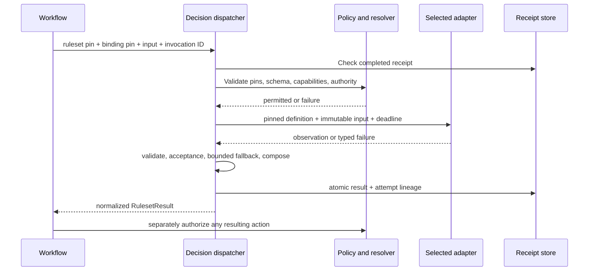

<!-- markdownlint-disable MD013 MD060 -->

# Decision system specification

Version: `decision.aiwg.io/v1alpha1`. Normative contract for #2573.
MUST/MUST NOT specify implementation requirements. The shared runtime and both
adapter seams implement this contract; live backend use and task-quality
qualification remain explicit opt-in rollout gates.

## 1. Ownership and identities

AIWG owns decision meaning, rule composition, validation, and final outcome selection. An adapter only evaluates a pinned decision against an immutable input snapshot. The workflow consumes AIWG results. Each artifact uses `apiVersion`, `kind`, `metadata`, and `spec`; metadata carries `id`, immutable semantic `version`, and human `description`. Unknown fields fail validation outside embedded JSON Schema and explicitly open maps.

References are `{id, version, digest}`. Digest is SHA-256 of the [RFC 8785 JSON Canonicalization Scheme](https://www.rfc-editor.org/rfc/rfc8785) representation encoded as UTF-8. All numbers must be finite IEEE-754 values; integer identity/budget fields stay within the safe-integer range. Arrays preserve order. Production validators must pass canonicalization vectors for fractions, Unicode, and property sorting. The example generator uses the equivalent sorted compact encoding for its ASCII-key/integer-only authored fixtures. Parse YAML to this JSON data model first; duplicate YAML/JSON mapping keys, aliases with cycles, non-string keys, duplicate identities/versions, and remote `$ref` resolution fail validation.

Resolver MUST check kind, identity, version, and digest before any execution or credential fetch. Definitions, rulesets, and bindings are immutable once referenced. Aliases may assist discovery but MUST be resolved and pinned in a run receipt. No hidden latest-definition selection. Model aliases are allowed only in bindings, with requested and returned model IDs recorded separately.

## 2. Normalized elements

The adjacent JSON Schemas define exact field names. Additional semantic constraints in this document are mandatory even where JSON Schema cannot express them.

### DecisionDefinition

Fields: purpose, inputSchema, question, answer, requiredCapabilities. `question` is portable instructions; input state is separate untrusted data, never interpolated as higher-authority instructions. v1 question and rubric descriptions are strings. Input schemas use draft 2020-12; references are local to the embedded schema only, with bounded validation depth/size. Unsupported schema keywords or validation dialects fail rather than silently passing.

Answer variants:

| Kind | Authoring data | Normalized value |
|---|---|---|
| choice | Two or more options with unique stable ID and description | One declared option ID string |
| ordinal-score | Two or more ordered, distinctly described levels | Number in `[0,N-1]`, including fractions; represents expected position over ordinal indices |
| truth-probability | Explicit true and false descriptions | Number in `[0,1]`, estimating the proposition's truth; never implicitly boolean |

A consumer wanting a boolean declares a comparison in a ruleset. Score rounding is forbidden unless a future separately versioned transformation explicitly specifies it. Option/level limits are backend capabilities, not global vendor limits on the portable vocabulary.

### DecisionRuleset

Fields: purpose, inputSchema, evaluations, rules, composition, conflict, defaultOutcome, failureOutcome, outputSchema. Evaluations reference decision definitions by alias and pin, and select input by JSON Pointer from the immutable ruleset input. Each alias is unique; empty pointer means whole input. v1 evaluations are independent; no decision consumes a sibling's output. Multi-stage dependent decisions use separate graph invocations. All evaluations complete before rule selection; no speculative action dispatch.

A rule has stable ID, integer priority, a declarative predicate, and JSON `outcome`. Predicates are bounded trees of `all`, `any`, `not`, or comparisons `eq/ne/lt/lte/gt/gte/exists`. Comparison source is input or a named decision result, addressed by JSON Pointer. Input pointers address the ruleset input root; decision pointers address the named DecisionResult `spec` projection, so `/value`, `/status`, and `/uncertainty/confidence` are valid roots (not `/spec/value`). No executable JavaScript, shell, network, or general expression evaluation. Type mismatch is an error, not coercion. `exists` tests presence (including an explicit null); other comparisons against missing paths yield `unknown`. Boolean logic uses three-valued semantics: false dominates `all`, true dominates `any`, otherwise unknown propagates; `not unknown` is unknown. Only true predicates match. A rule predicate may inspect status before value; it MUST NOT use a non-success result value (none is present).

In first-match mode, every authored rule outcome and fallback/default outcome MUST validate against outputSchema before execution. In collect mode, outputSchema MUST be an array schema with a single object-valued `items` schema (no tuple/prefixItems); individual rule outcomes validate against `items`, and default/failure plus every assembled array validate against the full outputSchema. Array-level constraints can therefore reject a composed result with `invalid-output`; no partial array is emitted. Priorities sort descending. Duplicate priorities are allowed but ties never depend on filesystem, arrival, or declaration order:

- `first-match`: inspect all matches at the highest matching priority. Equal outcomes (structural JSON equality) deduplicate; different outcomes use conflict policy `error` or `review`. Lower priorities do not override.
- `collect`: return an array of all matched outcomes sorted by descending priority then rule ID, preserving duplicates intentionally. outputSchema validates that final array. DefaultOutcome/failureOutcome must also be arrays. Priority is ordering only; no conflict among collected outcomes.

No match uses defaultOutcome with status `defaulted`. Caller cancellation dominates all composition: emit RulesetResult `cancelled` without outcome and stop further evaluation. Isolated worker cancellation without caller cancellation is recorded as decision `cancelled`; it is not fallback-eligible in v1. Any decision that remains error/abstained/unsupported/cancelled after binding fallbacks causes the ruleset's failureOutcome with status `review` before rule evaluation. This conservative v1 rule prevents a failed negative check from being treated as permission. Future optional decisions need an explicit schema version/field, not a silent skip. Ruleset conflicts either return `error` without outcome or `review` with failureOutcome. A matching rule returns status `completed`. A ruleset result is data only.

### DecisionBinding

A binding pins one ruleset and maps **every evaluation alias exactly once** to an ordered list of execution targets. Each target includes adapter name/version, model, pinned subagent reference when needed, credentialRef when needed, capability requirements, acceptance policy, timeout, retries, and retry delay bounds. No secrets, vault leaf paths, or credential values occur in definitions, bindings, or receipts. `credentialRef` is a logical resolver name; operator-injected locator/field settings remain outside portable artifacts.

In `v1alpha1`, acceptance policy remains either `typed-value` or `confidence-threshold`; its behavior does not change. Threshold uses integer basis points and a named confidence profile; missing confidence or a different profile causes abstention, never a zero/one substitution. typed-value permits validated values without claiming certainty.

`v1alpha2` additionally permits immutable `primitive-policy` acceptance. The policy has a semantic version, explicit `first-match` precedence, ordered rules, and separate default, missing-evidence, invalid-evidence, tie, and declared-fallback routes. Conditions compare named probability-normalized metrics in basis points: Noul yes probability; Choice selected probability, native confidence, top-two margin, normalized entropy and concentration; Score normalized expected value, native confidence, dispersion and concentration; and separately pinned calibrated risk. Raw probability, native confidence, provider distribution, derived statistics, and calibrated values remain distinct receipt evidence with provenance. The comparison projection retains eight decimal places of a basis point to remove binary floating-point representation noise; the raw statistic is never replaced. A policy cannot use a metric from another primitive. Choice may require explicit authored options such as `none` or `other`; validation fails rather than inventing one. Score expected values are normalized only for comparison and the original fractional value is retained without rounding.

`calibration: advisory` makes no correctness claim. `calibration: required` cannot route to action without a separately named calibrated-risk value and calibration reference. Non-`act` dispositions abstain and remain evidence only; they do not execute review, rejection, fallback, or any external action. A fallback route names its target for the surrounding dispatcher. Fallback targets each carry their own explicit acceptance profile; switching to a backend whose scores differ never reuses a Jev threshold implicitly. Binding root has total timeout and max attempts; exhaustion ends the run. `fallbackOn` contains only explicit terminal reason codes. Invalid definitions, digest mismatch, replay mismatch, uncertain remote execution, authorization denial, and data-boundary denial are never fallback-eligible.

Switchability means the same ruleset and definitions can use either conformant binding unchanged. A stricter ruleset capability requirement may intentionally make one backend ineligible. New backends must pass conformance and measured task-quality qualification before operational replacement.

### DecisionResult and RulesetResult

DecisionResult records decision/ruleset/binding pins, evaluation alias, run and invocation IDs, status, optional typed value, reason code, uncertainty, primitive-policy acceptance evidence when used, and all attempts. Status: `success`, `abstained`, `error`, `unsupported`, `cancelled`. Exactly success carries value. Output validation is against the referenced definition, not just a scalar type. Uncertainty is explicitly null when unavailable; otherwise its source, profile, calibration status, confidence, and distribution are preserved. Confidence and distribution can independently be null. Acceptance evidence records the policy version, disposition, matched rule or routing reason, optional declared fallback target, and every native/derived/calibrated value used. It never overwrites the provider distribution.

Attempt fields: monotonic ordinal, adapter/version, requested and actual model (actual may be null if unavailable), resolved pinned subagent identity when applicable, status/reason, duration, token usage and cost or null, and provider/worker request ID or null. Preserve failed Jev attempts when the final answer comes from an LLM fallback. Request IDs are opaque and MUST NOT contain raw credentials. Do not store full prompts, state, or private reasoning by default. Result provenance is execution evidence, not an authorization grant.

RulesetResult records run/invocation IDs, ruleset/binding pins, evaluation results keyed by alias, matched rule IDs, status (`completed/defaulted/review/error/cancelled`), reason, and optional outcome. Completed/defaulted/review carry outcome; error/cancelled do not. Outcome is validated against ruleset outputSchema. Resolved input snapshot is held in memory; protected artifact storage may retain it only by explicit policy. The private atomic receipt stores a fingerprint over the canonical input, ordered definition pins, ruleset pin and binding pin together with the invocation ID. This fingerprint remains inside protected storage, not in public logs/results. Reuse is allowed only for a completed receipt with an exact fingerprint match. Reusing an invocation ID with changed input, definition, ruleset or binding is `replay-mismatch` and MUST fail without a new call. Re-evaluation uses a fresh invocation ID. Incomplete receipts require reconciliation with an existing worker/provider handle when available; an unknown remote outcome is `execution-uncertain`, never silently retried. Exactly-once remote billing is not promised.

## 3. Evaluation algorithm and failure semantics

1. Resolve artifact root; load/pin/validate ruleset, definitions, binding, embedded schemas, references, aliases and predicates. Reject cycles/unresolved pointers in schemas, invalid option/level counts, impossible thresholds, and undeclared aliases. Enforce definition content and version integrity.
2. Validate inputs, project each evaluation input, then validate it against its definition. Missing required input is `invalid-input` before network access; input pointers may not escape the provided data.
3. Authorize backend use and data egress through existing AIWG policy. Model results cannot change permissions. Negotiate required capabilities with the selected adapter and input/option/level limits before loading its credential.
4. Execute independent evaluations with bounded concurrency under the minimum of binding, caller, graph, workspace, and provider ceilings. Each evaluation follows its ordered targets. Final rule composition is deterministic for the same normalized results, irrespective of completion order.
5. Validate native response shape and normalize strictly. Missing/extra answer identities, nonfinite/out-of-range numbers, wrong primitive, unknown choice, invalid distributions, invalid legend, and duplicate answer keys are `invalid-output`. No silent clamping or coercion. For distributions require exact option/level support and sum within `1e-6` of 1; keep original numbers. Jev score must equal weighted mean within `0.02` to accommodate displayed rounding; choice must be a maximal-probability option (ties may pick any maximum).
6. Apply target acceptance. Legacy thresholds retain their existing failure reasons. Primitive policies derive only metrics valid for the declared primitive, apply exact inclusive/exclusive basis-point boundaries, and use ordered first-match precedence for intentionally overlapping gray bands. Missing, invalid, tied, or calibration-incompatible evidence follows its explicit non-action route. No acceptance result has an action side effect. On configured eligible reason, the dispatcher may try the next target with the same definition and input.
7. Retriable transport responses: network transient, HTTP 429, 529, and 5xx. HTTP 401/403 => `authentication`; 400/404/422 => `invalid-request`; do not retry them automatically. Bounded retry policy applies inside the current target. `Retry-After` is honored up to the remaining deadline; otherwise exponential delay capped by max delay with bounded jitter. Do not retry invalid outputs to fish for a preferred answer. Each timeout attempt may already have incurred cost; record unknown costs, never zero by default.
8. The decision dispatcher owns backend retries and fallback; initial graph integration sets graph node retries to zero. Receipt lookup precedes any call. Total attempt cap includes retries and alternate targets. Cancellation propagates an AbortSignal and stops new calls; cancellation may not prevent remote billing. No streaming partial result is accepted.
9. Compose final rules as in §2. Persist sanitized receipt atomically, append activity/provenance events through existing facilities, return typed outcome and usage. A dependent action then passes ordinary policy/approval gates separately. Ledger/output write failure returns `persistence-error` and cannot dispatch actions. A retry must reconcile an existing invocation receipt before issuing more calls; exactly-once remote billing is not promised.

## 4. Adapter contract

Proposed TypeScript interface (types correspond to the adjacent schemas):

```ts
interface DecisionAdapter {
  readonly id: string;
  readonly version: string;
  capabilities(): Promise<{
    answerKinds: string[];
    features: string[];
    maxOptions: number | null;
    maxLevels: number | null;
    confidenceProfiles: string[];
    executable: boolean;
  }>;
  evaluate(request: {
    definition: DecisionDefinition;
    input: unknown;
    target: ExecutionTarget;
    invocationId: string;
    deadlineEpochMs: number;
    signal: AbortSignal;
    resolveCredential: (logicalRef: string) => Promise<Uint8Array>;
  }): Promise<AdapterObservation>;
}
```

AdapterObservation contains typed value, uncertainty metadata, actual model, usage, and request ID, or a typed failure code. It cannot mark a ruleset approved, alter definitions, or execute outcomes. Shared runtime owns acceptance, retry, validation, receipts and fallback. `capabilities()` describes actual configured execution support; `executable=false` fails before dispatch. Credentials are resolved only by the adapter when needed and are never passed to an LLM prompt.

An adapter may additionally advertise an atomic `native` batch capability and
implement `evaluateMany`. The runtime enables it only by explicit invocation
policy and only for independent questions with the same canonical
`decisionSubject`, projected state, ordered stage, adapter/version, target
(including model and credential reference), authorized egress policy, deadline,
and adapter execution-envelope identity. Stable opaque question IDs correlate
answers. Requested and returned IDs must be exactly equal; any missing, extra,
duplicate, or wrong-primitive answer invalidates every sibling in that provider
request. Results remain ordered by ruleset declaration, never response-map order.
Unsupported or ineligible groups use `evaluate` and record single-call
degradation evidence. Native batching is side-effect-free and remains disabled
unless a caller supplies an enabled batch policy. Receipt-backed invocations
degrade to single calls until the separately governed shared-usage receipt model
is available.

### Jev mapping

Map choice to Choice criteria by option ID; ordinal-score to the ordered Score description array; truth-probability to Noul with true/false criteria. Use an opaque evaluation alias as the question key and preserve input as state. Native HTTP request/response examples are in `evidence/jev-request.json` and `evidence/jev-live.json`. The live test returned fractional Score and absent Noul confidence, validating these distinctions.

Use the documented HTTPS endpoint and bearer authentication. Validate current limits (Choice 255 options, Score 2–10 levels) before dispatch. The model is binding-selected; returned model is retained. Batch only independent evaluations with identical input, target and acceptance envelope; v1 implementation may use one call per evaluation, which simplifies bounded retries and attribution. Batch optimization is optional and requires per-question identity/partial-failure tests. Native API errors and retry classes follow §3. [API reference](https://docs.typesafe.ai/api).

Choice confidence summarizes distribution concentration, not probability of correctness; retain it under profile `typesafe-distribution-v1`, source `provider`, calibration `vendor-claimed`. Noul maps its scalar to truth-probability with profile `typesafe-truth-v1`, source `provider`, calibration `vendor-claimed`, and null confidence/distribution. LLM truth estimates retain `llm-self-report-v1` metadata even when confidence/distribution are null, so absence of confidence does not erase the scalar's provenance. Its two-outcome distribution may be derived only if labeled `derived-bernoulli`, not provider-returned. v1 does not derive it. [Confidence](https://docs.typesafe.ai/confidence), [Noul](https://docs.typesafe.ai/primitives/noul).

Score preserves the expected ordinal index without rounding. Jev's limit and fractional interpretation are adapter constraints and answer semantics respectively. [Score](https://docs.typesafe.ai/primitives/score). Choice retains option IDs and probability support. [Choice](https://docs.typesafe.ai/primitives/choice).

### Ordinary LLM-subagent mapping

The binding subagent reference uses the same `{id,version,digest}` pin shape as other definitions. Resolve the registered worker artifact before dispatch and record that exact pin in each attempt; a missing or changed worker is `invalid-definition`. Examples use a local fixture worker description to demonstrate pinning, not an installed runnable agent. Use a registered existing subagent and configured provider/model through actual dispatcher/RunWorker transport, with a bounded single decision task, no tools, no filesystem/network mutation, and no inherited secrets. Provide portable question, option/rubric descriptions, input as untrusted data, and a generated strict JSON output schema. Require one JSON object; no markdown/prose scraping or repair retries. Prompt template and adapter version are pinned; full prompt need not be logged. Request only answer and optional uncertainty, never hidden reasoning.

The output schema allows either `{status:"success", value, uncertainty}` or `{status:"abstained", reason:"insufficient-information"}`. For ordinal-score, require a distribution over declared ordinal indices, validate it, and compute the weighted mean in shared normalization; never relabel an arbitrary scalar rating as an expected position. For truth-probability, preserve the model's estimated scalar as such. Choice returns an allowed ID. Optional confidence is `llm-self-report-v1`, calibration `uncalibrated`; absence remains null. Providers without structured output may emit JSON text, but identical parsing/validation is mandatory. Malformed output is `invalid-output`, and routed-but-not-executed is `executor-unavailable`.

A live subagent qualification must prove actual worker start/terminal events plus valid output, not merely a planned runtime selection. Fixture conformance does not claim that a particular provider/model has passed live task-quality qualification.

## 5. FlowGraph, discovery, persistence, and sequence

Publish a `decision-evaluate` dispatcher skill with a real discovered stable ID at implementation time. Use existing FlowGraph `skill` nodes and `spec.candidates` authorization. Node inputs are ruleset reference, binding reference, and input; output is RulesetResult. Node permissions include configured external inference/worker access, never the downstream outcome's action permissions. Keep provider bindings as external invocation configuration so swapping binding does not edit graph source. Adapter usage feeds graph resource accounting, including unknown-cost handling; a finite monetary ceiling requires a conservative configured price bound when exact cost is unavailable.



Discovery adds authored decision/ruleset/binding data classifications, schema linting, list/show support and reference edges. They are normalized first-class data, not loose prose inside vendor prompts. Resolver accepts a closed local/catalog source set under authorized roots; no path traversal, arbitrary URL fetches or executable artifact content. Runtime results are data, never ingested as trusted rules automatically.

## 6. Security, limits, and operations

Definition authorship and binding selection are trusted control inputs; model states and responses are untrusted data. Separate review of changes to rule outcomes, egress destinations, and executor permissions under existing workspace policy. Default logs contain only identities, counts, timings and reason codes. Raw state/response capture is disabled; the evidence here is deliberately synthetic. Reject credentials embedded in portable configuration; fetch using injected logical resolver configuration. Never log bearer headers, raw errors containing payloads, vault paths or secret hashes.

Jev key was inducted before first API use, verified by in-memory comparison, and retrieved from the vault for the smoke request. See sanitized receipt. The supplied operator file remains at mode 0600; no source deletion or reader-role provisioning is implied. Production rollout requires a least-privilege runtime reader through itops; it MUST NOT use the one-time administrative induction route. Per itops SOP, leaf secrets stay in the vault metadata catalog and are not mirrored to DATAGERRY.

Portable defaults for initial implementation: feature disabled; explicit binding required; one evaluation at a time; 30s total deadline; 15s per attempt capped by remaining total; 3 attempts total; at most one retry per target; 250ms initial/2s maximum retry delay. Examples intentionally use tighter/different values and are normative only for their binding. Caller/graph/workspace caps always narrow these. Monetary limits require configured bound or explicit caller authorization for unknown-cost execution. Authentication/configuration errors are visible diagnostics, not silent fallback to a free or different model.

## 7. Conformance boundary

Schemas validate structure; the semantic validator proves references, input projections, answer domains, rule predicates, acceptance profiles, distribution invariants and binding coverage. `fixtures/conformance.json` defines runtime acceptance cases to implement. `validate.py` checks design fixtures and selected semantic examples today; it is not the production runtime or complete transport conformance suite.

Qualification must separately measure task accuracy, abstention, calibration, latency and cost on a representative held-out set. No model-quality or performance equivalence follows from the one synthetic live request. Source observation date: 2026-09-20; all vendor limits/model aliases are revalidated when implementing.
